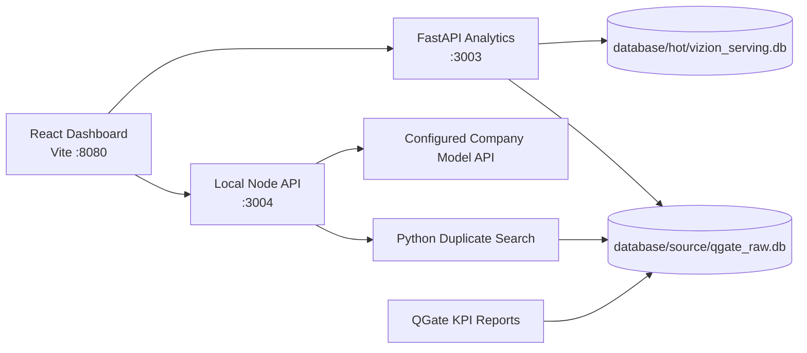

# Vizion Lab

[](#quick-start)
[](#technology-stack)
[](#technology-stack)
[](#quick-start)
[](#technology-stack)

Vizion Lab is a self-contained local analytics workspace for QGate / Octane defect intelligence, Main Dashboard reporting, duplicate issue search, AI-assisted defect context, and static KPI report generation.

It is designed for demo, review, and local daily operation: clone the repository, install dependencies, provide local data or Octane access, and run the complete dashboard without checking out any sibling project.

## Highlights

- Self-contained runtime: no sibling `TPMDashboard` checkout and no Lovable Playwright helper package required.
- Main Dashboard: local analytics API backed by repository-local SQLite source and hot databases.
- Duplicate Search: Python search backend embedded in this repository, with feedback and cache support.
- AI Chat: local Node API injects QGate defect context before calling configured company model endpoints.
- Native KPI Reports: QGate dashboard and compare reports generated directly from this repository.
- Operator-friendly refresh: one-command source refresh and optional Windows scheduled task wrapper.

## Demo Flow

A reviewer can evaluate the project in this order:

1. Start the local stack with `npm run dev`.
2. Open `http://127.0.0.1:8080`.
3. Review Main Dashboard and Top Issue / Coverage analysis pages.
4. Try AI Chat or Duplicate Search after configuring model credentials and local source data.
5. Generate static QGate reports with `npm run report:qgate-kpi`.

## Screens And Features

| Area | What it shows | Local backend |
| --- | --- | --- |
| Main Dashboard | defect outcomes, team expansion, ticket drilldowns, dashboard freshness | FastAPI analytics API on port `3003` |
| AI Chat | model responses enriched with related defect context | Node API on port `3004` plus local duplicate search |
| Duplicate Search | similar defect candidates and feedback loop | embedded Python bridge and SQLite source |
| Coverage Analysis | test coverage views derived from local analytics data | FastAPI analytics API |
| QGate Reports | standalone HTML dashboard and compare reports | native Python report generator |

## Architecture



## Technology Stack

| Layer | Technology |
| --- | --- |
| Frontend | React 18, Vite 8, TypeScript, Tailwind CSS, shadcn/Radix UI |
| Local API | Node.js 24, native HTTP server, SSE streaming |
| Analytics API | Python, FastAPI, Uvicorn |
| Data | SQLite source DB, SQLite hot DB, optional DuckDB/Parquet cold archive |
| Search | pandas, scikit-learn, sentence-transformers |
| Testing | Vitest, Testing Library, Pytest, Playwright |

## Quick Start

Run commands from the repository root in Windows PowerShell.

### 1. Use Node 24

```powershell
nvm use 24.14.0
```

### 2. Install JavaScript Dependencies

```powershell
npm ci
```

### 3. Create Python Environment

Use Python 3.12, which is the qualified runtime line for this repository.

```powershell
py -3.12 -m venv .venv
.\.venv\Scripts\python.exe -m pip install -r requirements.txt
```

If you need browser-based Octane cookie refresh, install Chromium once:

```powershell
.\.venv\Scripts\python.exe -m playwright install chromium
```

### 4. Start Everything

```powershell
npm run dev
```

The dev command starts three local services:

| Service | URL | Purpose |
| --- | --- | --- |
| Frontend | `http://127.0.0.1:8080` | dashboard UI |
| Local Node API | `http://127.0.0.1:3004` | AI chat, duplicate search, transcription |
| Analytics API | `http://127.0.0.1:3003` | full-picture and analytics endpoints |

The Node API binds to `127.0.0.1` and accepts only `localhost`/`127.0.0.1` Host and Origin values on the configured `VIZION_API_PORT` and `VIZION_WEB_PORT`. API POST bodies must use `application/json` and are capped at 16 MiB by default; set `VIZION_API_JSON_BODY_LIMIT_BYTES` to a positive byte count when a controlled local transcription workflow needs a different finite limit. Remote access requires an authenticated gateway rather than exposing the local listener directly.

### 5. Verify Services

```powershell
$frontend = Invoke-WebRequest -Uri 'http://127.0.0.1:8080' -UseBasicParsing -TimeoutSec 5
$localApi = Invoke-WebRequest -Uri 'http://127.0.0.1:3004/health' -UseBasicParsing -TimeoutSec 5
$analytics = Invoke-WebRequest -Uri 'http://127.0.0.1:3003/health' -UseBasicParsing -TimeoutSec 5
"FRONTEND $($frontend.StatusCode)"
"LOCALAPI $($localApi.StatusCode) $($localApi.Content)"
"ANALYTICS $($analytics.StatusCode) $($analytics.Content)"
```

## Data Setup

The app can start without private data, but real dashboard content requires a compatible local SQLite source database.

Default paths:

| Purpose | Path |
| --- | --- |
| Source DB | `database/source/qgate_raw.db` |
| Hot dashboard DB | `database/hot/vizion_serving.db` |
| Cold archive | `database/cold/` |

### Use An Existing SQLite Source

```powershell
.\.venv\Scripts\python.exe -m backend.analytics_cli stage-full-picture-source --db-path C:\path\to\qgate_raw.db
.\.venv\Scripts\python.exe -m backend.analytics_cli refresh-full-picture-outcomes
```

### Pull Data From Octane

```powershell
.\.venv\Scripts\python.exe -m backend.analytics_cli refresh-octane-cookie --headless
.\.venv\Scripts\python.exe -m backend.analytics_cli refresh-all-sources --teams "DTSV_China" --years 2026 --manual-years 2026 --team-name DTSV_China
```

For multiple teams or years:

```powershell
.\.venv\Scripts\python.exe -m backend.analytics_cli refresh-all-sources --teams "DTSV_China,[AT]CoC_EI_IuK" --years 2025,2026 --manual-years 2026 --team-name DTSV_China
```

### Optional Data Overrides

Use explicit overrides only when you intentionally want paths outside the default repository layout:

```powershell
$env:VIZION_DATABASE_ROOT = "C:\path\to\database-root"
$env:VIZION_FULL_PICTURE_SOURCE_DB_PATH = "C:\path\to\qgate_raw.db"
$env:VIZION_FULL_PICTURE_HOT_DB_PATH = "C:\path\to\vizion_serving.db"
$env:DUPSEARCH_SQLITE_PATH = "C:\path\to\qgate_raw.db"
```

## Credentials

Secrets are local runtime inputs. Do not commit them.

### Octane

Default Octane values:

| Setting | Default |
| --- | --- |
| Base URL | `https://octane-prod.bmwgroup.net` |
| Shared space ID | `1002` |
| Workspace ID | `2001` |
| Cookie file | `cookie.txt` |

Optional overrides:

```powershell
$env:VIZION_OCTANE_BASE_URL = "https://octane-prod.bmwgroup.net"
$env:VIZION_OCTANE_SHARED_SPACE_ID = "1002"
$env:VIZION_OCTANE_WORKSPACE_ID = "2001"
$env:VIZION_OCTANE_COOKIE_FILE = "C:\path\to\cookie.txt"
```

### AI Model Access

Company model endpoint access:

```powershell
$env:DUPSEARCH_CHAT_ACCESS_CODE = "<company-access-code>"
```

OpenAI-compatible fallback style:

```powershell
$env:DUPSEARCH_CHAT_API_KEY = "<api-key>"
$env:DUPSEARCH_CHAT_API_BASE = "https://api.deepseek.com/v1"
```

When both are configured, the company access code takes precedence. Without a company access code, the API key/base pair also applies to the default model selection. Explicit model endpoint maps fail closed when malformed or empty. Remote model origins require HTTPS and cannot contain credentials, query parameters, or fragments.

Use the same comma-separated strict model allowlist in server-owned `DUPSEARCH_CHAT_MODEL_OPTIONS` and public UI `VITE_DUPSEARCH_CHAT_MODEL_OPTIONS`. When either variable is explicitly set, its list replaces the defaults instead of extending them; release configuration must keep the two values identical.

Transcription credentials are separate from chat credentials. Configure either a company ASR access code or an explicit remote ASR provider:

```powershell
$env:DUPSEARCH_TRANSCRIBE_PROVIDER = "company"
$env:DUPSEARCH_TRANSCRIBE_ACCESS_CODE = "<company-asr-access-code>"
# or
$env:DUPSEARCH_TRANSCRIBE_PROVIDER = "remote"
$env:DUPSEARCH_TRANSCRIBE_URL = "https://asr.example.net/transcribe"
$env:DUPSEARCH_TRANSCRIBE_API_KEY = "<asr-api-key>"
```

Always set `DUPSEARCH_TRANSCRIBE_PROVIDER=company` or `remote`; credentials alone never select a provider. Remote ASR also requires its dedicated API key. Remote ASR origins require HTTPS, reject URL credentials/query/fragment and redirects, use a finite 60-second default deadline, and never reuse chat credentials; `DUPSEARCH_TRANSCRIBE_TIMEOUT_MS` may be set from 1 to 300000 milliseconds.

Remote OCR is opt-in and accepts only `data:image/...;base64,...` attachments. Set `DUPSEARCH_OCR_PROVIDER=remote`, `DUPSEARCH_OCR_URL`, and the dedicated `DUPSEARCH_OCR_API_KEY`; optional `DUPSEARCH_OCR_AUTH_SCHEME` defaults to `Bearer`, and `DUPSEARCH_OCR_TIMEOUT_MS` defaults to 60000 with a maximum of 300000. Remote OCR follows the same HTTPS, URL-component, redirect, bounded-timeout, and upstream-error redaction policy. Without these variables, OCR stays on the local RapidOCR adapter and never reads client-supplied filesystem paths.

Default model order:

- `deepseek-v4-flash`
- `qwen3.5-397b-a17b`
- `glm-5`

## Governed Agent Deployment

The dashboard can run locally with its trusted internal principal. A shared or production deployment must use OIDC and keep the analytics service private.

Use the [pre-production Agent release runbook](docs/deployment/preproduction-agent-release.md) for immutable qualification, the gateway route matrix, server-owned configuration, network/OIDC smoke checks, canary rollout, and rollback.

AI Chat has one production orchestration path: LangGraph. `VIZION_AGENT_RUNTIME=legacy`, empty values, and unknown values all normalize to `langgraph`; there is no legacy server-entry fallback. Keep rollback and migration changes inside the governed LangGraph path so actor scope, evidence release validation, and terminal audit cannot be bypassed.

### Authentication Modes

| Mode | Intended use | Behavior |
| --- | --- | --- |
| `internal` | local development or a trusted single-user machine | server-owned internal principal from `VIZION_INTERNAL_*` settings |
| `oidc` | shared, LAN, or production deployment | default; fails closed unless a valid bearer token and server-owned scope policy resolve an actor |

`npm run dev` loads `.env` and `.env.local`, then uses `internal` only when `VIZION_AGENT_AUTH_MODE` is unset. In that local mode it creates one process-local actor-capability secret for the Node and FastAPI children, defaults the defect row scope to `DTSV_China`, and grants the read-only `agent.operations.read` policy for the local Agent Operations view. Set any `VIZION_INTERNAL_TEAM_IDS`, `VIZION_INTERNAL_PROJECT_IDS`, or `VIZION_INTERNAL_WORKSPACE_IDS` value to override the row scope, or set `VIZION_INTERNAL_ROW_POLICY_IDS` to override the local operator policy. `npm start` retains the fail-closed `oidc` default. When Node and FastAPI are started separately, configure the same `VIZION_AGENT_ACTOR_CAPABILITY_SECRET`, an explicit `VIZION_INTERNAL_*` row scope, and any required row policy in `.env.local`. Set OIDC explicitly for a shared or production deployment:

```powershell
$env:VIZION_AGENT_AUTH_MODE = "oidc"
$env:VIZION_OIDC_ISSUER = "https://issuer.example.com"
$env:VIZION_OIDC_AUDIENCE = "vizion-lab"
$env:VIZION_OIDC_JWKS_URI = "https://issuer.example.com/.well-known/jwks.json"
```

`VIZION_OIDC_ISSUER` and `VIZION_OIDC_JWKS_URI` must use HTTPS. The browser sends its current Supabase/OIDC session token only in the `Authorization: Bearer` header for AI Chat and transcription; identity and scopes in either JSON request body are ignored.

AI Chat persistence is also actor-scoped. Authenticated conversations use an opaque actor-derived browser-storage namespace, switching actors immediately switches the visible conversation set, and the old origin-wide `dtsv.chat.v2` key is removed rather than migrated across accounts. Anonymous conversations are not persisted.

Map verified subjects/groups to complete server-owned grants with `VIZION_AGENT_OIDC_SCOPE_POLICY_JSON`. A grant must include non-empty `allowedObjectTypes`; a user matching multiple different grants is denied rather than receiving a field-wise union.

```json
{
  "groups": {
    "dtsv-readers": {
      "allowedObjectTypes": ["quality.defect"],
      "teamIds": ["DTSV_China"],
      "projectIds": ["IDCEVO"]
    },
    "agent-operators": {
      "allowedObjectTypes": ["quality.defect"],
      "teamIds": ["DTSV_China"],
      "projectIds": ["IDCEVO"],
      "rowPolicyIds": ["agent.operations.read"]
    }
  }
}
```

### Actor Capability and Network Boundary

The Node agent signs short-lived actor capabilities for agent-only analytics routes with `VIZION_AGENT_ACTOR_CAPABILITY_SECRET`. This secret is server-to-server only: do not expose it through Vite variables, browser storage, audit logs, or model prompts.

Rotate the capability secret with a coordinated maintenance window:

1. Stop new AI Chat traffic at the reverse proxy.
2. Replace the secret in both Node and FastAPI service environments.
3. Restart both services together.
4. Restore traffic and run the qualification commands below.

The current verifier accepts one secret at a time, so rolling one service before the other intentionally causes agent-only queries to fail closed. Keep FastAPI port `3003` bound to loopback or a private network; do not expose it directly to browsers. Place the Node API behind the authenticated reverse-proxy boundary for shared deployments.

When FastAPI is not colocated with Node, set `VIZION_ANALYTICS_API_BASE` to its private HTTPS origin; use mTLS or an encrypted service mesh where required. Plain HTTP is accepted only for exact loopback hosts (`127.0.0.1`, `localhost`, or `::1`). The value must not contain credentials, a path, query, or fragment. Configuration precedence is `VIZION_ANALYTICS_API_BASE`, then `VIZION_ANALYTICS_PORT`, then `http://127.0.0.1:3003`; the Node proxy, Agent tools, governed analytics context, and Vite development proxies use the same resolved origin. `VIZION_ANALYTICS_PROXY_TIMEOUT_MS` bounds analytics proxy and default Agent analytics requests. Vite binds to `127.0.0.1` and is not a shared-environment ingress.

Production routing is explicit: approved dashboard reads under `/api/full-picture/*`, `/api/testing/*`, `/api/metadata/*`, and `/api/correlation/*` go through the authenticated gateway to private FastAPI; Agent/chat, Agent Operations, static, and QGate-report routes go to the loopback Node service. Do not publish `/api/semantic/*`, `/api/agent/analytics/*`, or actor-capability routes. Because the Node local boundary accepts only loopback Host/Origin values, the colocated gateway must validate the public Origin, preserve the bearer token, rewrite the upstream Host to the configured loopback Node address, and remove the already-validated browser Origin. See the runbook for the complete route contract.

Duplicate search and the legacy allowlisted fallback query do not yet have row-scope enforcement. They are available only in `internal` mode; scoped OIDC actors receive a safe denial from the associated tools and `/api/ai/context` or `/api/duplicate-search*` routes. The main Agent also refuses to release data claims from any legacy tool or implicit analytics/duplicate context without a complete evidence contract, including in internal mode. The dedicated duplicate-search UI remains separate. Do not re-enable these paths for OIDC users until their backend retrieval path enforces the same actor scope and evidence contract.

### Runtime Ontology Governance

Compiled business rules in `ontology/v1/business_rules.json` are executable in both the Node planner and the Python semantic API:

- `deny` returns a safe policy rejection and never creates tool steps.
- `require` turns an unmet governed semantic into a clarification/rejection before a data provider runs.
- `derive` can add only an approved static policy filter; it narrows results and never broadens actor scope.
- `plan_warning` remains informational only.

The approved created-defect rule requires `time.defect_creation_date` whenever a created-defect query references event time. Matching rule codes are retained in the QueryPlan, governed context, semantic API response, and sanitized runtime summary. Semantic trace results also include an approved AIDA-to-TestCase-to-TestRun-to-Defect relationship path with cardinality/join policy, source revision, and row-index evidence; the Traceability dashboard exposes approved relationship IDs on graph edges.

After changing ontology source, regenerate and validate the bundle before starting services:

```powershell
npm run ontology:compile
npm run ontology:check
npm run test:ontology
```

### Bounded Recovery and Quality Gates

Agent recovery never generates SQL, code, or a broader scope. A failed read is retried only once in either of these cases:

- The scoped empty-result diagnosis verifies a `FILTER_VALUE_ALIAS` and changes only the same `detected_by` filter value.
- A semantic schema or draft-metric failure has exactly one valid, same-scope canonical step in the governed QueryPlan.

Each recovery audit stores the original and revised query fingerprints, source tool call, applicable source plan, reason, and outcome. Filter relaxation, ambiguous catalog matches, policy denials, sensitivity denials, and multiple matching plan steps are never retried automatically.

Semantic quality checks reject unsupported trace joins and unbounded many-to-many paths before source reads. Source freshness warnings, including `SOURCE_STALE`, appear in semantic tool context. Claim-bearing answers are buffered until every factual segment is citation-bound to a unique executed tool/evidence pair; citation markup does not bypass the causal check. Invalid answer text is discarded before release and emits machine-readable violations such as `ANSWER_CAUSAL_CLAIM_UNSUPPORTED`.

### Auditable Agent Qualification

Generate a qualification artifact from the current checkout:

```powershell
npm run agent:qualification
```

The mandatory gates actually execute the deterministic Agent fixture suite and `ontology:check`. Add the complete Node test suite and production build when qualifying a release:

```powershell
npm run agent:qualification -- --full --build
```

The command writes `artifacts/agent-qualification/latest.json` atomically and exits non-zero when Node is not 24.x, any selected command fails, the checkout is dirty before or after the run, or repository/dependency state changes while the gates are running. Run `npm ci` in the exact candidate checkout first. Schema 1.2 records the Git commit and dirty state, Node version, `package-lock.json` hash, candidate-local installed dependency tree hash, Vite/Vitest versions and executed entrypoint hashes, Ontology fingerprint, runtime-ready/planned metric counts, every target JSONL fixture's case count and SHA-256, and each executed command's duration and exit code. With `--build`, it also records every `dist` file's size/SHA-256 and a canonical tree hash so verification detects deployment artifact drift. It never records environment-variable values or credentials.

Verify the payload hash and compare the artifact with the current commit, Ontology fingerprint, runtime capability report, and fixture files:

```powershell
npm run agent:qualification:verify
```

Use `--output <path>` with either command for a CI artifact location. A generated path inside the checkout must be Git-ignored so the artifact cannot make its own checkout dirty; an output path outside the checkout is also accepted. Verification rejects modified payloads, a different or dirty checkout, Ontology fingerprint drift, runtime capability drift, fixture drift, failed/missing gates, or an artifact whose evidence classification was changed. The payload SHA-256 is an integrity checksum, not a cryptographic signature or independent provenance attestation.

`evidenceClass` is always `deterministic_fixture` and `productionSnapshot` is always `false`. A pass means only that the checked-in deterministic fixtures and selected repository gates passed; it is not a production-data result, model accuracy measurement, latency SLO, or proof of business effectiveness. Python is not invoked implicitly. Run an explicitly selected virtual-environment interpreter separately when a release policy also requires Python tests.

Repeat the full qualification twice after any OIDC policy, actor-capability, agent route, tool recovery, Ontology, or model-streaming change.

### Operations Audit and Retention

LangGraph writes append-only runtime artifacts below `logs/agent-runtime/` by default. The root/subdirectories are forced to mode `0700` and files to `0600` on supported hosts:

- `run-summaries.jsonl`: normalized summary records
- `run-events.jsonl`: lifecycle and stream-completion events
- `tool-calls.jsonl`: tool audit records
- `threads/`: checkpoints

The file store uses an explicit allowlist: it derives scope-bound opaque run/thread references and retains only scope hashes, plan/fingerprint identifiers, tool/recovery outcomes, evidence status, terminal status and stable failure codes. It drops raw query text, client-provided run/thread IDs, actor identity/grants, tool input/output and stacks; process metrics retain query length only, never a query preview. The Agent Operations page still requires the server-resolved `agent.operations.read` row policy, and external storage must enforce equivalent access control and encryption. Configure retention and backup jobs; a recommended starting policy is 30 days for events/tool audits, 90 days for summaries, and no backup of thread checkpoints unless an approved incident process requires it.

### Emergency Rollback

To preserve dashboard read-only access during an agent incident, block `/api/ai/chat`, `/api/chat`, and `/api/agent-operations/*` at the reverse proxy or stop the Node API on port `3004`. The React dashboard's analytics routes continue to use the FastAPI service on port `3003`. Restore agent traffic only after the failed qualification check has been corrected.

## Commands

### Development

```powershell
npm run dev
npm run dev:client
npm run dev:server
npm run dev:analytics
```

### Tests

```powershell
npm test
.\.venv\Scripts\python.exe -m pytest backend\tests -q
```

Auditable Agent qualification artifact:

```powershell
npm run agent:qualification
npm run agent:qualification -- --full --build
npm run agent:qualification:verify
```

Run only the deterministic fixture suite without generating an artifact:

```powershell
npm run test:agent-evals
```

Focused runtime-isolation checks:

```powershell
npm test -- src/test/server/projectIsolation.test.ts src/test/server/companyChat.test.ts
.\.venv\Scripts\python.exe -m pytest backend\tests\test_octane_auth.py backend\tests\test_analytics_outcomes.py backend\tests\test_asset_loader.py backend\tests\test_analytics_cli_smoke.py -q
```

### QGate KPI Reports

```powershell
npm run report:qgate-kpi
```

Equivalent Python command:

```powershell
.\.venv\Scripts\python.exe -m backend.analytics_cli generate-qgate-kpi-reports
```

Custom output or compare years:

```powershell
npm run report:qgate-kpi -- --output-root docs/qgate-reports/custom_runs
npm run report:qgate-kpi -- --years 2024,2025
```

Default output:

- `docs/qgate-reports/generated_runs/<timestamp>/`

### Source Refresh

```powershell
.\.venv\Scripts\python.exe -m backend.analytics_cli refresh-all-sources --teams "DTSV_China" --years 2026 --manual-years 2026 --team-name DTSV_China
```

Useful smaller refresh commands:

```powershell
.\.venv\Scripts\python.exe -m backend.analytics_cli refresh-octane-source --teams "DTSV_China" --years 2026
.\.venv\Scripts\python.exe -m backend.analytics_cli refresh-manual-runs-source --team-name DTSV_China --years 2026
.\.venv\Scripts\python.exe -m backend.analytics_cli refresh-full-picture-outcomes
```

### Duplicate Search Evaluation

Export confirmed duplicate-search feedback into an eval-case file:

```powershell
.\.venv\Scripts\python.exe -m backend.analytics_cli export-duplicate-search-eval-cases --feedback-db-path .\backend\database\duplicate_feedback.db --output-path .\docs\duplicate-search-eval-cases.generated.json
```

Run the offline duplicate-search evaluation:

```powershell
.\.venv\Scripts\python.exe -m backend.analytics_cli evaluate-duplicate-search --eval-cases .\docs\duplicate-search-eval-cases.generated.json --top-k 10
```

### Nightly Refresh On Windows

Manual run:

```powershell
powershell -ExecutionPolicy Bypass -File .\scripts\run-nightly-source-refresh.ps1
```

Nightly refresh includes Octane comments by default. Comment loading is incremental: unchanged defects reuse cached comments, and only changed or missing comment snapshots are refreshed. Use `-CommentMode skip` only when you intentionally need a faster defect/history-only refresh.

Register scheduled task:

```powershell
powershell -ExecutionPolicy Bypass -File .\scripts\register-nightly-source-refresh-task.ps1
```

The registered task also passes `-PrepareDuplicateIndex 1`, so duplicate search can use the prepared index manifest after the nightly data refresh.

Logs are written under:

- `database/hot/logs/`

## Repository Layout

```text
backend/                 Python analytics, ingest, reports, duplicate search
backend/analytics/       FastAPI service, SQLite processing, report builders
server/                  Local Node API for AI chat and duplicate bridge runtime
scripts/                 Dev startup and Windows refresh helpers
src/                     React dashboard application and tests
database/                Local source/hot/cold data area
docs/qgate-reports/      Generated static KPI reports
supabase/                Supabase config and edge-function placeholders
```

## Runtime Isolation

Default runtime does not require:

- A sibling `TPMDashboard` or `TPMDashbaord` repository
- `lovable-agent-playwright-config`
- Hard-coded user Desktop paths
- A separate `dupsearch-agent` project

External data and credentials can still be provided through explicit environment variables, but the app does not silently search a sibling local repository.

## Before Pushing To GitHub

Check the worktree:

```powershell
git status --short
```

Avoid committing local or private artifacts:

- `.venv/`
- `node_modules/`
- `__pycache__/`
- `.pytest_cache/`
- `cookie.txt`
- `login_info.txt`
- `.env` with real secrets
- `database/**/*.db`
- `database/**/*.db-wal`
- `database/**/*.db-shm`
- generated reports unless intentionally shared

## Troubleshooting

### Node Version Error

```powershell
nvm use 24.14.0
```

### Python Install Fails Behind Proxy

Use the same terminal/proxy setup normally used for Python package installation, then rerun:

```powershell
.\.venv\Scripts\python.exe -m pip install -r requirements.txt
```

### Dashboard Opens But Has No Data

Stage or refresh `database/source/qgate_raw.db`, then run:

```powershell
.\.venv\Scripts\python.exe -m backend.analytics_cli refresh-full-picture-outcomes
```

### AI Chat Has No Model Response

Set `DUPSEARCH_CHAT_ACCESS_CODE`, or set `DUPSEARCH_CHAT_API_KEY` and `DUPSEARCH_CHAT_API_BASE`, before starting `npm run dev`.

### Cookie Refresh Fails

```powershell
.\.venv\Scripts\python.exe -m playwright install chromium
.\.venv\Scripts\python.exe -m backend.analytics_cli refresh-octane-cookie --headless
```
