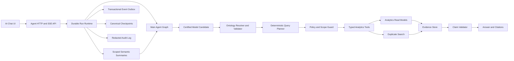

# Main Agent V2 architecture

## Objective

Build an engineering-grade intelligent analytics Agent whose business meaning is controlled by a versioned Ontology, whose plans are deterministic and policy-checked, and whose answers are traceable to authorized evidence.

## Control and data planes

The Ontology is the semantic control plane. It defines entities, relationships, dimensions, governed metrics, vocabulary, time semantics, source mappings, policies, constraints, and allowed operations. Node and Python consumers must load the same compiled fingerprint. The certified model only proposes a strict semantic candidate; deterministic resolution, Ontology validation, policy injection, constraint enforcement, and plan compilation make the final decision. Invalid or unavailable model output takes a safe deterministic fallback and never broadens authority.

The Runtime is the execution control plane. It owns identity, actor scope, admission control, thread versioning, Run idempotency, leases, checkpoints, interactions, event ordering, cancellation, recovery, and audit. The graph supports deterministic multi-step execution and bounded replanning while the persistent StepJournal prevents duplicate side effects. A completed Run persists `answer.completed` before its terminal event and can store a compact validated SemanticFrame summary for later Runs in the same thread and actor scope. Elliptical follow-ups may inherit only compatible semantics under the same Ontology fingerprint; authorization and policy filters are always recomputed for the current actor and Run.

The Analytics and duplicate-search systems form the data plane. They can only be reached through registered typed tools; arbitrary SQL, shell, file write, and direct model-generated endpoint access are not planner capabilities.

## Non-negotiable invariants

1. One active Run per thread and one terminal event per Run.
2. Every persisted event is actor-authorized, monotonic, replayable, and committed with the state transition it describes.
3. Every quantitative claim references evidence from the same Run and actor scope.
4. Similarity evidence is never accepted as a population statistic.
5. Missing, zero, partial, stale, and unavailable are distinct states.
6. Only approved Ontology metrics may be planned without clarification.
7. Model output is a proposal; schemas, Ontology, policy, budgets, and deterministic validation remain authoritative.
8. Recovery resumes only the canonical checkpoint under the same graph and Ontology compatibility rules.
9. CI uses deterministic model and tool fixtures and requires no enterprise credential.
10. Cutover is controlled by qualification gates, shadow comparison, and an immediate rollback switch.
11. A planner-model turn is externally observable only through a safe completion/fallback event; prompts, candidates, provider errors, and model output are not public telemetry.

## Delivery slices

- Phase 0: baseline and stability integration.
- Phase 1: executable evaluation, load runner, and CI gate.
- Phase 2: versioned Ontology V1 shared by Node and Python.
- Phase 3: SemanticFrame, time resolver, ambiguity handling, and QueryPlan.
- Phase 4: unified graph and semantic analytics tool execution.
- Phase 5: grounded evidence, claims, citations, and answer rendering.
- Phase 6: checkpoint, interaction, worker, lease, and recovery completion.
- Phase 7: security, artifacts, API contracts, and governance.
- Phase 8: observability, shadow/canary, capacity qualification, and cutover.
