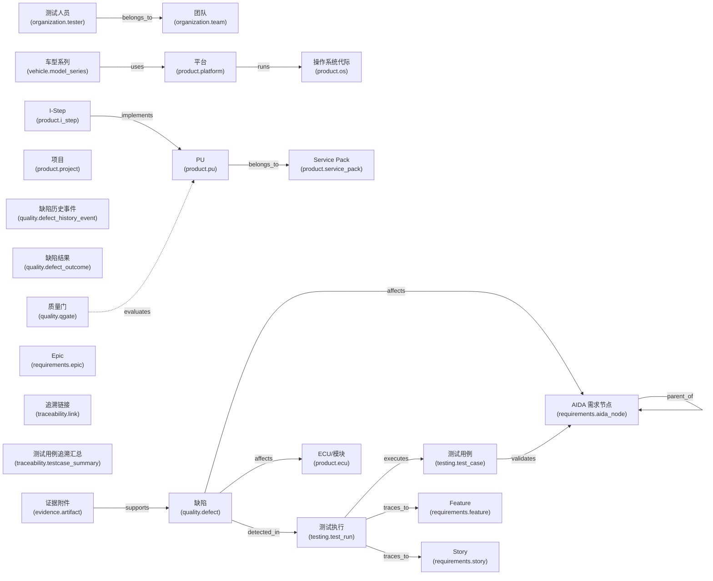

# Ontology Entity Relationship Graph

> Auto-generated by `compileOntology.mjs --emit-graph`. Do not edit by hand.

```mermaid
flowchart LR
    evidence_artifact["证据附件\n(evidence.artifact)"]
    organization_team["团队\n(organization.team)"]
    organization_tester["测试人员\n(organization.tester)"]
    product_ecu["ECU/模块\n(product.ecu)"]
    product_i_step["I-Step\n(product.i_step)"]
    product_os["操作系统代际\n(product.os)"]
    product_platform["平台\n(product.platform)"]
    product_project["项目\n(product.project)"]
    product_pu["PU\n(product.pu)"]
    product_service_pack["Service Pack\n(product.service_pack)"]
    quality_defect["缺陷\n(quality.defect)"]
    quality_defect_history_event["缺陷历史事件\n(quality.defect_history_event)"]
    quality_defect_outcome["缺陷结果\n(quality.defect_outcome)"]
    quality_qgate["质量门\n(quality.qgate)"]
    requirements_aida_node["AIDA 需求节点\n(requirements.aida_node)"]
    requirements_epic["Epic\n(requirements.epic)"]
    requirements_feature["Feature\n(requirements.feature)"]
    requirements_story["Story\n(requirements.story)"]
    testing_test_case["测试用例\n(testing.test_case)"]
    testing_test_run["测试执行\n(testing.test_run)"]
    traceability_link["追溯链接\n(traceability.link)"]
    traceability_testcase_summary["测试用例追溯汇总\n(traceability.testcase_summary)"]
    vehicle_model_series["车型系列\n(vehicle.model_series)"]
    evidence_artifact -->|"supports"| quality_defect
    organization_tester -->|"belongs_to"| organization_team
    product_i_step -->|"implements"| product_pu
    product_platform -->|"runs"| product_os
    product_pu -->|"belongs_to"| product_service_pack
    quality_defect -->|"affects"| requirements_aida_node
    quality_defect -->|"affects"| product_ecu
    quality_defect -->|"detected_in"| testing_test_run
    quality_qgate -.->|"evaluates"| product_pu
    requirements_aida_node -->|"parent_of"| requirements_aida_node
    testing_test_case -->|"validates"| requirements_aida_node
    testing_test_run -->|"executes"| testing_test_case
    testing_test_run -->|"traces_to"| requirements_feature
    testing_test_run -->|"traces_to"| requirements_story
    vehicle_model_series -->|"uses"| product_platform
```
