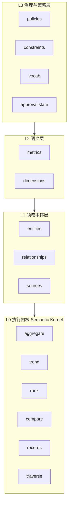
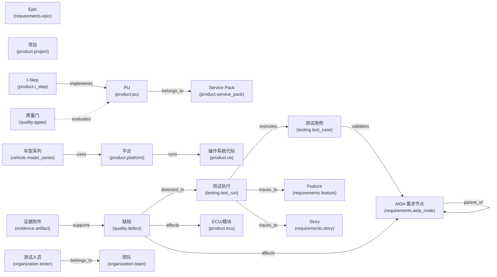
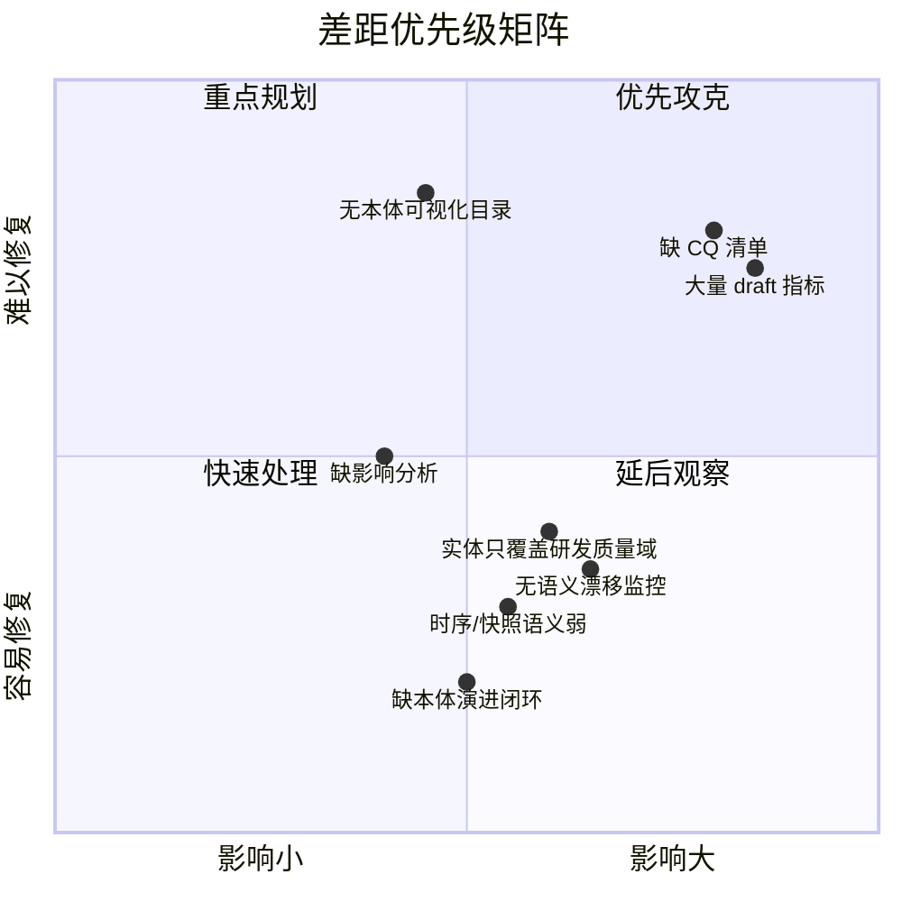
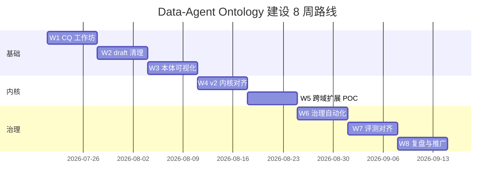
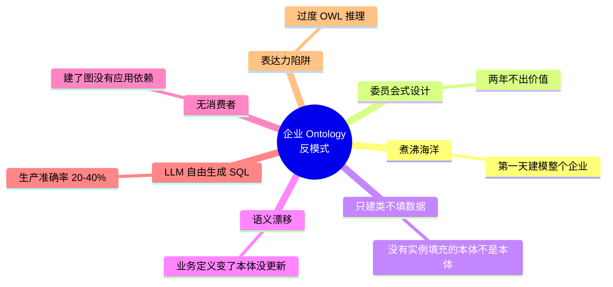

# Data-Agent 企业/团队级 Ontology 建设计划与可视化

> 本文件供 Obsidian 打开查看。所有图表使用 Mermaid，Obsidian 原生支持渲染。
> 来源：基于全网 ontology/semantic layer/enterprise knowledge graph 研究 + Data-Agent 仓库现状分析。

---

## 一、核心结论

Data-Agent 已经具备一套**行业领先的语义控制平面雏形**：

- `ontology/v1`：19 实体、15 关系、22 维度、22 指标、37 条中文词汇
- `scripts/compileOntology.mjs` + JSON Schema + SHA-256 指纹
- Node/Python 双端 resolver、planner、scope policy、证据链
- 策略层：只读、强制 actor scope、脱敏、拒绝 draft/任意 SQL/超限

**下一步不是推倒重来，而是把它升级为「可治理、可演进、可产品化」的团队级本体。**

---

## 二、目标架构：三层 + 一执行内核

---

## 三、Ontology V1 实体关系图

> 虚线表示 `draft` 状态的关系；实线表示 `approved`。

---

## 四、现状差距（Gap）

---

## 五、8 周落地路线图

| 周 | 里程碑 | 产出 |
|---|---|---|
| W1 | CQ 工作坊 | `ontology/cq-list.md` 定稿 |
| W2 | draft 清理 | 核心 10 指标 approved，其余挂决策单 |
| W3 | 本体可视化 | 编译器输出 Mermaid/目录页 |
| W4 | v2 内核对齐 | 六原语契约测试先行 |
| W5 | 跨域 POC | 选 1 新域建 3 实体 + 5 CQ |
| W6 | 治理自动化 | PR 模板 + draft 超期提醒 + 指纹影响报告 |
| W7 | 评测对齐 | 每 approved CQ ≥1 golden case |
| W8 | 复盘与推广 | 价值指标看板 |

---

## 六、关键反模式

---

## 七、相关文件

- `ontology/cq-list.md` — 35 条胜任问题（12 approved / 9 draft / 14 gap）
- `docs/ontology/team-ontology-playbook.md` — 完整 playbook
- `docs/main-agent-v2/ontology-v1.md` — V1 治理说明
- `docs/main-agent-v2/metric-decisions.md` — 指标决策清单
- `docs/superpowers/plans/2026-07-20-testing-quality-ontology-v2-semantic-kernel.md` — v2 执行计划

---

## 八、参考来源（已验证）

- [Frontiers in Big Data, 2025 — LLM-supported collaborative ontology design](https://www.frontiersin.org/journals/big-data/articles/10.3389/fdata.2025.1676477/full)
- [Improvado — Enterprise Knowledge Graph Guide 2026](https://improvado.io/blog/enterprise-knowledge-graph)
- [Atlan — Ontology vs Semantic Layer](https://atlan.com/know/ontology-vs-semantic-layer/)
- [Cube — Semantic Layer for AI Agents 2026](https://cube.dev/articles/semantic-layer-for-ai-agents-2026)
- [SurrealDB — Context layers, semantic layers, and knowledge graphs](https://surrealdb.com/blog/context-layers-semantic-layers-and-knowledge-graphs-the-modern-data-architecture-for-ai)
- [arXiv 2604.00555 — Ontology-Constrained Neural Reasoning in Enterprise Agentic Systems](https://arxiv.org/abs/2604.00555)
- [Palantir Foundry — Ontology Overview](https://www.palantir.com/docs/foundry/ontology/overview/)
- [PMC — Knowledge-graph best development practices for industry](https://pmc.ncbi.nlm.nih.gov/articles/PMC10038788/)
