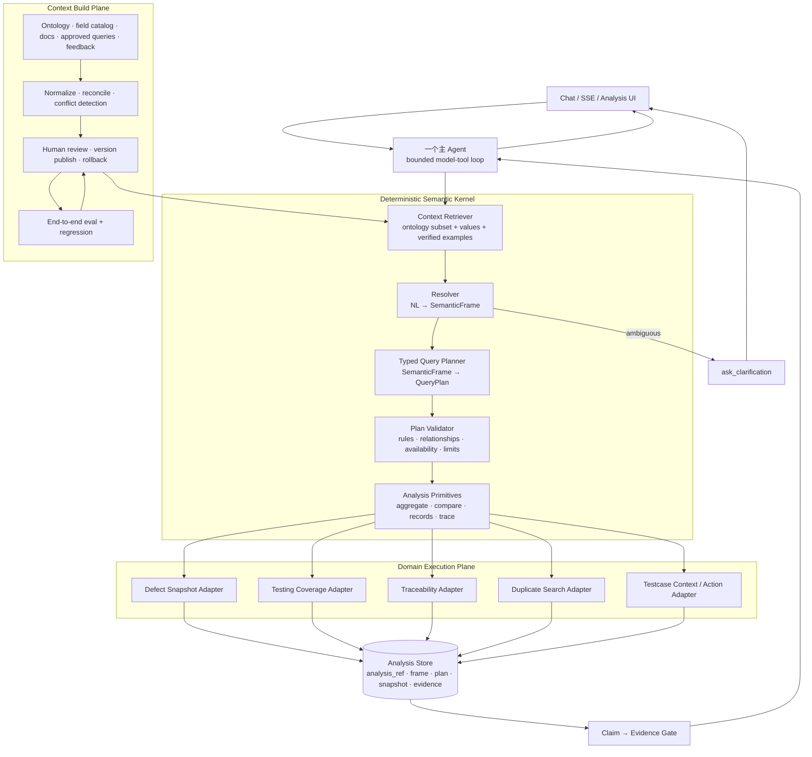

# 智能问数 / Data Agent 全网深度调研与 Data-Agent 代码级对标

> 调研日期：2026-08-03（Asia/Shanghai）<br>
> 目标项目：`Data-Agent`<br>
> 基线分支：`feature/2026-07-30-main-agent-recovery-sync`，基线提交：`e764175c44266439c8f715ca23be49e45a78acb8`<br>
> 研究原则：只把源码、官方文档和论文当成架构证据；把“当前已实现”“预览/路线图”“营销主张”分开。

---

## 0. 结论先行

### 0.1 你的最佳路线不是接入某一个现成项目

最适合 Data-Agent 的不是完整迁入 WrenAI、DB-GPT、Datus 或某个多 Agent 框架，而是保留你的汽车测试领域数据能力，建设一个 **Wren/Cube/MetricFlow 风格的确定性 Semantic Kernel + ktx/OpenMetadata 风格的可审查上下文建设面 + Snowflake/Genie 风格的 verified-query/eval 飞轮**。

在线默认架构仍应是：

```text
一个主 Agent
  → 有界 model → tool → observation → model 循环
  → 少量类型化分析原语
  → 隐藏的确定性 Semantic Kernel
  → 固定快照的数据执行与证据
  → Claim → Evidence 校验后回答
```

不建议把 CHESS/CHASE-SQL 的四 Agent、多候选投票直接放进在线主链路。它们对 benchmark 很有效，但带来额外时延、成本和不可观测分支，更适合作为离线评测、困难样本诊断或按阈值触发的兜底。

### 0.2 行业在 2026 年的共同收敛方向

这次调研最明显的变化是：领先项目已经从“NL → SQL”转向“**上下文构建 → 受治理语义计划 → 确定性执行 → 结果验证 → 反馈回灌**”。

共同机制包括：

1. **语义对象先于 SQL**：指标、维度、关系、粒度、过滤和时间含义先结构化，再生成或执行查询。
2. **组织知识进入版本化资产**：术语、规则、verified queries、历史成功查询、数据质量与来源不再只塞进 prompt。
3. **Agent 不直接拥有事实解释权**：Agent 负责理解、规划和叙事；指标计算、关系展开、权限、快照和证据由确定性系统负责。
4. **用户反馈必须经过审核再沉淀**：Snowflake VQR、Genie knowledge mining、Wren memory、ktx reconciliation 都在做这一层。
5. **评测从 SQL 字符串比较升级为执行结果和回归**：运行 SQL、比较结果、检测 regression 和 latency，而不只检查 prompt 或路由。

### 0.3 对你最重要的任务排序

| 优先级 | 必须建设的工程能力 | 直接效果 | 主要对标来源 |
|---|---|---|---|
| **P0-1** | `SemanticFrame → QueryPlan → AnalysisResult` 统一契约，彻底收敛语义工具与旧页面工具双轨 | 同一问题不再因选中不同工具得到不同口径 | WrenAI、Cube、MetricFlow、Snowflake Semantic View |
| **P0-2** | 真正的 aggregate / compare / records 三类原语；records 返回行而不是再次聚合 | 完成“聚合发现异常 → 同快照明细解释”闭环 | Cube、MetricFlow、SLayer、Genie |
| **P0-3** | `snapshot_version + analysis_ref + evidence_ref` 一等公民，所有追问复用原分析上下文 | 多轮追问不漂移、结论可复现 | Snowflake multi-turn/VQR、Wren dry-plan、Palantir Ontology |
| **P0-4** | `Claim → Evidence` 最终答案门禁 + 失败 run 审计 + LLM timeout/retry | 从“prompt 要求有证据”升级为“无证据不能发布” | Wren correctness primitives、Snowflake eval、Vanna 生命周期设计 |
| **P0-5** | 30–50 条真实问题的端到端 golden：解析、执行结果、证据、追问连续性 | 每次改动能证明更准而不是“感觉更智能” | Snowflake Analyst evaluations、Datus benchmark、CHESS |
| **P1** | Context Build Plane：来源采集、冲突检测、人工审核、发布、回滚 | 本体和知识可持续生长而不是手工堆 JSON | ktx、WrenAI、OpenMetadata、Genie knowledge store |
| **P1** | 受控 schema/value linking：候选召回、值字典、歧义阈值与澄清 | 中文术语、项目/模块/版本值匹配显著提升 | CHESS IR/SS、Genie prompt matching、XiYan M-Schema/DateResolver |
| **P1** | 精简工具面，只保留分析原语和业务适配器 | 降低模型选错工具概率和维护成本 | Cube API、SLayer structured query、Wren CLI primitives |
| **P2** | 缓存/预聚合、正式 RLS/多租户、图投影、沙箱 Python、多候选 ensemble | 规模化或复杂分析增强 | Cube、OpenMetadata、Palantir、DB-GPT、CHASE-SQL |

你已经明确当前是内网小规模团队使用，因此正式用户体系、RLS、多租户治理 **保留接口但不列入当前 P0/P1**。

---

## 1. 调研方法与证据等级

### 1.1 证据等级

| 等级 | 含义 | 本报告如何使用 |
|---|---|---|
| **A：源码可验证** | GitHub 仓库、具体源码目录或文件能证明调用路径 | 可以作为代码级架构事实 |
| **B：官方文档** | 厂商/项目官方文档描述当前能力 | 可作为产品契约；闭源内部实现仍未知 |
| **C：同行评审论文** | 正式会议论文或论文仓库 | 可作为算法与 benchmark 证据，不等于生产工程成熟度 |
| **D：官方营销材料** | 产品页、博客、发布稿 | 只描述方向或对外承诺，不当作代码实现证据 |

### 1.2 活跃度快照

下表来自 2026-08-03 的 GitHub 仓库元数据，只用于判断维护状态；star 和提交时间会继续变化。

| 项目 | 当日约 star | 最近推送 | 状态 |
|---|---:|---|---|
| [WrenAI](https://github.com/Canner/WrenAI) | 16.8k | 2026-08-03 | 活跃；2026-05 完成重大仓库重构 |
| [Cube](https://github.com/cube-js/cube) | 20.5k | 2026-08-03 | 活跃 |
| [MetricFlow](https://github.com/dbt-labs/metricflow) | 1.7k | 2026-07-31 | 活跃；Apache 2.0 |
| [Datus](https://github.com/Datus-ai/Datus-agent) | 1.4k | 2026-08-03 | 活跃、快速扩张 |
| [ktx](https://github.com/Kaelio/ktx) | 1.5k | 2026-07-19 | 活跃、较新 |
| [SLayer](https://github.com/MotleyAI/slayer) | 144 | 2026-08-03 | 活跃、生态较早期 |
| [DB-GPT](https://github.com/eosphoros-ai/DB-GPT) | 19.6k | 2026-08-03 | 活跃、平台范围很广 |
| [Vanna](https://github.com/vanna-ai/vanna) | 23.8k | 2026-02-02 | **2026-03-29 已归档，只读** |
| [OpenMetadata](https://github.com/open-metadata/OpenMetadata) | 14.6k | 2026-08-03 | 活跃、企业元数据平台 |
| [Dataherald](https://github.com/Dataherald/dataherald) | 3.6k | 2024-07-24 | 非归档但长期无推送；仅作历史参考 |

---

## 2. Data-Agent 当前真实架构基线

### 2.1 已经具备的正确基础

1. **一个主 Agent + 有界循环**。当前默认运行时已是 `langgraph`，单次最多 4 个工具步骤；不是旧报告所说的“legacy 默认”。见 [langGraphChatRuntime.mjs](../../server/agentRuntime/langGraphChatRuntime.mjs#L234) 和 [langGraphChatRuntime.mjs](../../server/agentRuntime/langGraphChatRuntime.mjs#L271)。
2. **显式状态机**。六个节点是 `initialize → resolve_context → route_tools → plan_tool_calls ⇄ execute_tool_calls → finalize`。见 [langGraphChatRuntime.mjs](../../server/agentRuntime/langGraphChatRuntime.mjs#L534)。
3. **领域 Ontology 已有相当规模**。当前工作树中有 28 个实体、50 个维度、30 个指标、27 个关系、12 条业务规则、5 个约束和 3 个动作；这比多数通用 NL2SQL 项目更懂你的业务。
4. **存在受治理的语义工具入口**：`query_semantic_metrics`、`query_semantic_records`、`query_traceability`。见 [mainAgentTools.mjs](../../server/mainAgentTools.mjs#L160)。
5. **已有领域工具资产**：重复缺陷检索通过 `search_duplicates` 适配，测试用例目前能获取 `get_test_case_context`，而不是要求重写已有模块。见 [mainAgentTools.mjs](../../server/mainAgentTools.mjs#L487) 和 [mainAgentTools.mjs](../../server/mainAgentTools.mjs#L700)。
6. **缺陷数据已有快照基础设施**，并且语义结果能携带 `sourceRevision`/质量元数据。这是完成固定快照 drilldown 的好基础。

### 2.2 当前最关键的代码级断点

#### 断点 A：工具面仍是“新语义工具 + 旧页面工具”双轨

[mainAgentToolRegistry.mjs](../../server/mainAgentToolRegistry.mjs#L1) 中一个意图经常同时暴露 `query_semantic_*`、`query_analytics`、`query_analytics_fallback`、`query_full_picture_module`、`query_defect_records` 等多个重叠工具。这样模型不仅要理解问题，还要猜哪个页面/旧 API 才是正确口径。

工程结论：**不要继续加页面级工具**。最终工具面应收敛为 `semantic_aggregate`、`semantic_compare`、`semantic_records`、`semantic_trace`、`duplicate_search`、`testcase_context/generate`、`ask_clarification`。

#### 断点 B：`query_semantic_records` 目前不是真正 records

语义 planner 会把 `list/drilldown` 路由到 `query_semantic_records`，见 [queryPlanner.mjs](../../server/ontology/queryPlanner.mjs#L99)。但 Python 执行器最终仍调用 `_aggregate_rows()`，按维度分组并计数，见 [semantic_query.py](../../backend/analytics/semantic_query.py#L499) 和 [semantic_query.py](../../backend/analytics/semantic_query.py#L575)。

这会直接破坏最重要的闭环：

```text
聚合发现高增长模块
  → 想取这些模块的 ticket 样本解释
  → “records” 又返回一张分组计数表
```

#### 断点 C：缺失维度可能被物化为 `(missing)`

[semantic_query.py](../../backend/analytics/semantic_query.py#L491) 会把缺失值格式化为 `(missing)`，并在聚合中只给 warning。这对真实存在但某行为空的字段可以接受；对数据源根本不提供的语义维度则不应该接受。后者必须 fail closed 或先完成字段物化，否则 Agent 会把“不存在的数据能力”叙述成一个有效分组。

#### 断点 D：Ontology 中的关系、业务规则和候选消歧没有形成同一执行链

- `getRelationship()` 存在于 registry，但生产 planner 没有进行通用关系路径展开。见 [registry.mjs](../../server/ontology/registry.mjs#L73)。
- planner 当前明确读取的约束主要是 `planner.approved_metric_only` 与 `query.max_limit`，见 [queryPlanner.mjs](../../server/ontology/queryPlanner.mjs#L77)。
- `semanticCandidate.mjs` 有 schema/messages/parser，但当前生产代码没有调用者。见 [semanticCandidate.mjs](../../server/ontology/semanticCandidate.mjs#L1)。
- `business_rules.json` 已生成，但当前 server/backend 运行链没有加载并执行这些规则。

这说明 Ontology 的“定义完整度”已经领先于“运行时兑现度”。

#### 断点 E：没有一等公民的 `analysis_ref`

生产代码当前没有统一的 `analysis_ref`/`analysisRef` 合约。快照信息分散在不同 payload 中，后续追问也没有一个稳定引用可以恢复原始 `SemanticFrame`、`QueryPlan`、结果范围、证据和同快照 records 查询。

#### 断点 F：证据被收集，但最终答案没有强制发布门禁

运行时会把工具 evidence 累积到状态，见 [langGraphChatRuntime.mjs](../../server/agentRuntime/langGraphChatRuntime.mjs#L258)；但缺少一个统一的程序化 `Claim → Evidence` validator，不能保证最终答案里的每个数字、Top N、增长率和因果措辞都能回指工具结果。

#### 断点 G：运行韧性和失败审计仍不完整

- `companyChat.mjs` 仍是直接 `fetch`，见 [companyChat.mjs](../../server/companyChat.mjs#L397) 和 [companyChat.mjs](../../server/companyChat.mjs#L459)。
- runtime state 只在 `graph.invoke()` 成功返回后持久化；异常 run 不能依赖这条路径留下完整终态，见 [langGraphChatRuntime.mjs](../../server/agentRuntime/langGraphChatRuntime.mjs#L553)。
- `MemorySaver` 是进程内 checkpoint，适合开发，不是长期会话存储。

#### 断点 H：当前评测更像组件测试，还不是 Data Agent 资格测试

当前有 10 条主 Agent tool-routing golden 和 113 条 semantic-frame golden。主路由测试在本次审计中已通过；但 semantic golden 主要验证解析 frame，并不验证：

- 最终执行结果是否正确；
- compare 计算是否用同一快照；
- drilldown 是否真的返回原始记录；
- 回答中的数字和证据是否一致；
- follow-up 是否复用原 `analysis_ref`。

---

## 3. 开源项目详细拆解

## 3.1 WrenAI：2026 年最值得对齐的“开放上下文层”方向

**证据等级：A/B。**<br>
GitHub：[Canner/WrenAI](https://github.com/Canner/WrenAI)<br>
官方架构：[Architecture](https://docs.getwren.ai/oss/reference/architecture)<br>
核心执行代码：[core/wren/src/wren/engine.py](https://github.com/Canner/WrenAI/blob/main/core/wren/src/wren/engine.py)

### 2026-05 之后的真实定位

WrenAI 已不是旧印象中的 Docker Chat BI 应用。2026-05-07，旧 `wren-engine` 合并到主仓库 `core/`；旧 chat-first 产品被保留到 `legacy/v1`，且不再获得新功能和安全修复。当前主线是：**让外部 Agent 通过 CLI、SDK、skills 使用一个开放、可版本化的上下文和语义执行层**。

### 四层架构

1. **Agent Workflow**：Markdown skills 规定 onboarding、建模、查询、验证、记忆更新的操作顺序。
2. **Project Context**：MDL、instructions、profile、memory 保存业务语义、规则、样例和已验证经验。
3. **Planning Engine**：把 modeled SQL 展开为目标数据源 SQL。
4. **Execution Layer**：连接器执行已展开 SQL并返回 Arrow 结果。

### 代码级执行路径

`WrenEngine.dry_plan()` 的路径不是简单调用一次 `wren-core.transform_sql()`：

```text
目标方言 SQL
  → sqlglot parse
  → 找出模型/视图引用
  → 从完整 MDL 抽取最小 effective manifest
  → strict mode / denied functions policy 校验
  → wren-core SessionContext
  → CTERewriter 把每个 modeled object 展开为 CTE
  → 生成目标方言 SQL
  → connector dry-run / query
```

源码直接描述了该 flow，并在查询执行前做 policy validation、manifest scope extraction 和 dialect rewrite。项目结构也清楚分成：

- `core/wren-core/`：Rust + Apache DataFusion 语义计划；
- `core/wren-core-base/`：MDL manifest 类型和 builder；
- `core/wren-core-py/`：Python binding；
- `core/wren/`：Python CLI/SDK、连接器、memory、policy；
- `sdk/wren-langchain/`：LangChain/LangGraph 工具适配；
- `skills/`：上下文建设工作流。

### 正确性机制

官方把正确性拆成 schema linking、value profiling、ambiguity detection、generation trace、retry/repair、eval 六个 primitive，而不是宣称“有语义层就不会错”。`wren dry-plan` 暴露模型、join、CTE 和 expanded SQL；structured errors 支持 Agent 修复。

### 当前未完成/不能误写的部分

官方架构明确写明 golden NL-SQL eval 仍在 development；完整 audit log、rate limit、approval workflow、data-flow inspector 仍在 roadmap。因此不能把 WrenAI 写成已经拥有全部生产治理能力。

### 对 Data-Agent 的价值

**应借鉴：**

- 可审查、版本化的 Context Artifacts；
- `dry-plan → validate → execute` 分离；
- strict manifest scope 和 structured errors；
- 记忆只保存经确认样例，不把所有对话自动当事实；
- SDK/tool adapter 边界。

**不建议现在直接集成 `wren-core`：**

- Wren 的核心执行对象是 SQL warehouse 上的 modeled SQL；你的数据源包括 Python read models、缺陷快照、traceability、duplicate search 等非统一 SQL 服务。
- 把 JSON Ontology 再转换成 MDL 会制造两个语义事实源和同步风险。
- 你的主要缺口是契约统一、records/snapshot/evidence 闭环，不是缺一个 SQL AST 重写器。

结论：采用 **Wren-aligned native architecture**，不是把 Wren 当主运行时。

---

## 3.2 Cube：最成熟的开源语义服务与性能工程参考

**证据等级：A/B。**<br>
GitHub：[cube-js/cube](https://github.com/cube-js/cube)<br>
官方概览：[Cube Introduction](https://docs.cube.dev/docs/introduction)<br>
预聚合：[Pre-aggregations](https://docs.cube.dev/docs/pre-aggregations/index)

### 架构原理

Cube 把语义层定位为所有消费面的上游服务：模型用 YAML/JavaScript 管理，`Cube` 表示实体及其 measures/dimensions/joins，`View` 表示对人和 Agent 暴露的 curated dataset。

主要接口：

- Postgres-compatible Semantic SQL，并扩展 `MEASURE()`；
- REST / GraphQL；
- Meta API 供 Agent 发现可查询对象；
- MCP / Chat 作为 Agent 接入面。

所有查询都先通过语义 runtime，确定性应用模型和访问策略，再访问 warehouse。

### 性能核心

Cube 的突出价值不是聊天层，而是 **pre-aggregation + aggregate awareness**：在模型中声明 rollup，由后台刷新并存入 Cube Store；查询到来时自动匹配可用 rollup。这是高并发 BI 场景中控制延迟和 warehouse 成本的成熟方案。

### 对 Data-Agent 的价值

**应借鉴：**

- `Meta API` 式的模型发现，而不是把完整 Ontology 塞入 prompt；
- 结构化 query contract；
- semantic service 与 UI/Agent 解耦；
- 数据量和并发上来后使用预聚合，而不是在 Agent 层做缓存猜测。

**暂不建议引入：** 当前主要是内网小规模使用，且数据执行不是单一 warehouse。除非未来把核心缺陷/测试数据统一进 SQL warehouse，否则引入完整 Cube Store 会过早增加运维面。

---

## 3.3 dbt MetricFlow：最值得借鉴的 QueryPlan 内核

**证据等级：A/B。**<br>
GitHub：[dbt-labs/metricflow](https://github.com/dbt-labs/metricflow)<br>
核心代码：[metricflow/engine/metricflow_engine.py](https://github.com/dbt-labs/metricflow/blob/main/metricflow/engine/metricflow_engine.py)

### 架构原理

MetricFlow 不负责聊天。它把指标请求编译成 dataflow query plan，优化后再转成目标引擎 SQL：

```text
MetricFlowQueryRequest
  → parse / validate query spec
  → DataflowPlanBuilder
  → DataflowPlan optimizations
  → DataflowToSqlPlanConverter
  → SQL renderer / execution plan
```

源码中能看到 `DataflowPlanBuilderCache`、`DataflowPlanOptimization`、`DataflowToSqlPlanConverter` 和 `DataflowToExecutionPlanConverter` 的分层。dataflow nodes 对 read source、filter、time constraint、aggregation、metric computation、conversion join、offset、semi-additive、order/limit 等操作建模。

### 为什么它比“LLM 直接选工具”更适合做内核参考

- 指标、维度、实体、时间粒度都进入 typed request；
- join path 和 grain 由计划器处理；
- 计划可以 explain、测试和缓存；
- Agent 只需生成/补全受控 request，不负责计算正确性。

### 对 Data-Agent 的价值

不要把你的领域都改造成 dbt 项目，但应把 `QueryPlan` 做成真正可遍历的计划，而不是“一个 toolName + canonicalArgs”。尤其需要计划节点：

```text
ResolveScope → SelectSnapshot → Aggregate → Compare → SelectAnomaly
→ FetchRecords → ComputeEvidence → PublishAnalysis
```

这会让固定快照 drilldown 和 `analysis_ref` 自然成为计划的一部分。

---

## 3.4 ktx：2026 年最值得借鉴的 Context Build Plane

**证据等级：A。**<br>
GitHub：[Kaelio/ktx](https://github.com/Kaelio/ktx)

### 定位

ktx 把自己定义为 data agents 的 executable context layer。它不是只建一个指标 YAML，而是把 warehouse introspection、dbt/MetricFlow/LookML/BI 元数据、历史 SQL、Notion/wiki 等来源统一采集、去重、标来源并检测矛盾，再输出可审查的 YAML/Markdown 资产。

### 代码结构

```text
packages/cli/src/context/          Context ingestion/reconciliation/index
packages/cli/src/connectors/       数据源 introspection 和只读连接器
packages/cli/src/mcp/              Agent 运行时接口
python/ktx-sl/                     语义查询计划
python/ktx-daemon/                 计算 sidecar
```

项目文件也明确区分：

```text
ktx.yaml                           配置
semantic-layer/<connection-id>/    可版本化语义资产
wiki/global/                       共享业务知识
wiki/user/<user-id>/               用户级笔记
raw-sources/<connection-id>/       采集证据与报告
.ktx/                              本地状态和密钥，不入 Git
```

连接器策略支持 `read-only-sql` 和 `semantic-layer-only` 两种模式，意味着是否允许 raw SQL 是确定性配置，不由 Agent 临时决定。

### 对 Data-Agent 的价值

你的 Ontology 当前是“人工编辑/脚本增强 → compile”，还缺一个正式的知识供应链。最值得复制的是：

```text
source evidence
  → normalize
  → propose semantic change
  → detect conflict
  → human review
  → publish version
  → rebuild index/eval
```

不建议直接把 ktx 设为运行时依赖，因为你的数据源和领域对象不是纯 warehouse；建议原生实现一个较窄但完整的 Context Build Plane。

---

## 3.5 Datus：完整 Agent Workflow 与评测工程参考

**证据等级：A。**<br>
GitHub：[Datus-ai/Datus-agent](https://github.com/Datus-ai/Datus-agent)<br>
核心 Agent：[datus/agent/agent.py](https://github.com/Datus-ai/Datus-agent/blob/main/datus/agent/agent.py)

### 架构原理

Datus 使用可配置 node workflow：

```yaml
schema_linking
parallel:
  - gen_sql
  - reasoning
selection
execute_sql
output
```

节点分为：

- Core：schema linking、execute SQL、reasoning、reflect、output；
- Agentic：gen SQL、chat、explore、gen semantic model、gen metrics、report 等；
- Control flow：parallel、selection、subworkflow；
- Utility：date parser、doc search、fix。

RAG Knowledge Base 使用 LanceDB，分层存储 schema metadata、reference SQL、Jinja 模板、semantic models、executable metrics 和文档。它还支持 per-node model、BIRD/Spider 2.0-Snow benchmark、LLM trace、FastAPI/CLI/Web/MCP、多数据库 adapter。

### 2026 年新增方向

近期 release 加入 permission profile、session resume/rewind、ask-user、scoped context、只读 SQL、deliverable validation hook、项目 memory 和数据工程 subagents。这说明它正在从 NL2SQL 扩张为通用 data-engineering agent 平台。

### 对 Data-Agent 的价值

**应借鉴：** node contract、workflow config、trace、benchmark runner、deliverable validation、context scope。

**不应照搬：** 默认多节点/多模型/多 subagent 流程。你的主问题是领域口径与证据闭环，广泛的数据工程 Agent 能力会扩大攻击面和维护面。

---

## 3.6 SLayer：轻量可嵌入 Semantic Query Engine 参考

**证据等级：A。**<br>
GitHub：[MotleyAI/slayer](https://github.com/MotleyAI/slayer)

### 架构原理

SLayer 用结构化 API 接收 `source_model + measures + dimensions + filters`，在进程内或独立服务中编译 join、aggregation、time calculation 和 dialect SQL。它暴露 Python、CLI、REST、MCP、Arrow Flight SQL 和 Postgres wire facade。

核心 `SlayerQueryEngine` 的准备链可概括为：

```text
resolve model/fields
  → enrich query / expand join graph
  → generate SQL
  → apply forced-filter SessionPolicy rewrite
  → cache key / execute
  → response attributes
```

值得注意的是 policy rewrite 在 SQL 执行前强制应用，且 cache key 与 policy 结果绑定，避免缓存绕过策略。

### 局限

官方明确写明当前没有 caching/pre-aggregation engine，该能力仍在 roadmap。项目活跃但生态和生产验证远小于 Cube。

### 对 Data-Agent 的价值

如果未来出现一个独立 SQL warehouse 域，SLayer 比完整 Cube 更容易作为嵌入式 adapter 做技术验证。但它不应替换你的 Ontology Semantic Kernel，也不能解决 duplicate/traceability/testcase 等非 SQL 能力。

---

## 3.7 DB-GPT：通用 Data Agent 平台，不适合作为你的主架构

**证据等级：A。**<br>
GitHub：[eosphoros-ai/DB-GPT](https://github.com/eosphoros-ai/DB-GPT)

DB-GPT 当前覆盖 task planning、SQL/Python 代码执行、RAG、skills、AWEL workflow、多模型、多数据源、sandbox、报告和图表。仓库包含 `packages/`、`pilot/`、`skills/`、`examples/`、`tests/` 和 web，2026-03 发布 v0.8.0。

它最值得借鉴的是：

- 生成代码/SQL必须进 sandbox；
- 输出是可复用 artifact/report，而不是只返回一段聊天；
- skill 封装重复分析流程；
- 多源分析统一管理执行环境。

但你的核心链路不需要任意 Python 代码执行，也不需要一个通用多 Agent 平台。现在迁入 DB-GPT 会弱化已有 Ontology 和领域 API，换来大量你暂时不需要的部署与治理面。

---

## 3.8 Vanna 2：架构可参考，但仓库已归档

**证据等级：A。**<br>
GitHub：[vanna-ai/vanna](https://github.com/vanna-ai/vanna)

Vanna 2 的架构是：

```text
<vanna-chat>
  → FastAPI ChatHandler
  → Agent
  → ToolRegistry / user-aware tools
  → row-level filtering
  → SSE table/chart/summary components
```

它把 `UserResolver`、user/groups、tool access group、lifecycle hooks、middleware、conversation storage、observability 和 streaming UI component 都做成明确扩展点。这些接口设计仍值得参考。

但仓库已于 2026-03-29 归档并只读。因此：**不能作为新的关键依赖选择**，更不能再把它列为“活跃开源 SOTA 项目”。

---

## 3.9 OpenMetadata：企业 Context Graph 的上游参考

**证据等级：A。**<br>
GitHub：[open-metadata/OpenMetadata](https://github.com/open-metadata/OpenMetadata)

OpenMetadata 不是直接的智能问数 Agent，而是统一技术元数据、质量、lineage、ownership、usage、policy、glossary、metrics、contracts、conversations/memory 的 Context + Memory Graph。仓库有 130+ connectors、MCP、API、SDK 和开放 schema。

它对 Data-Agent 的价值在于定义“证据上下文”不只是术语：

- 指标定义和业务术语；
- 来源、owner、质量、freshness、certification；
- column/data-product lineage；
- 决策、假设、事故与修复记录。

当前不建议部署完整 OpenMetadata：对内网小团队和现有数据规模太重。建议先借鉴 provenance schema，把 `source_id/version/as_of/quality/owner/evidence` 纳入你的 Ontology publication 和 `analysis_ref`。

---

## 3.10 Dataherald：历史产品分层参考，不建议新集成

**证据等级：A。**<br>
GitHub：[Dataherald/dataherald](https://github.com/Dataherald/dataherald)

Dataherald monorepo 分为 Engine、Enterprise、Admin Console、Slackbot 四个服务，代表较早期“核心 NL2SQL 引擎 + 用户/组织层 + 配置观测后台 + 渠道接入”的产品分层。

但仓库最近推送停留在 2024-07，当前不能作为 2026 年技术依赖候选。它只适合说明“控制面与执行面分离”的历史工程模式。

---

## 4. 学术系统：哪些机制值得拿，哪些不应照搬

## 4.1 CHESS：信息召回、schema 剪枝、候选生成、unit test

**证据等级：A/C。**<br>
GitHub：[ShayanTalaei/CHESS](https://github.com/ShayanTalaei/CHESS)

CHESS 的四个角色：

1. Information Retriever：关键词、实体和值召回；预处理使用 minhash、LSH 和向量索引。
2. Schema Selector：从大 schema 选表和列。
3. Candidate Generator：生成并迭代修复 SQL。
4. Unit Tester：生成自然语言测试并评价候选。

源码目录与论文模块一一对应：`src/workflow/agents/information_retriever`、`schema_selector`、`candidate_generator`、`unit_tester`。

对你的直接价值：

- 把候选召回和最终解析分开；
- 大 Ontology 只取 query-relevant 子图；
- value linking 不用纯子串；
- 端到端 golden 可加入“期望不变量/反例”，不只比对象 ID。

不应照搬：四个在线 Agent。你的 Ontology 规模有限，先做一个确定性 retrieval pipeline + 主 Agent 澄清即可。

## 4.2 CHASE-SQL：多路径候选与 preference selector

**证据等级：C。**<br>
论文：[ICLR 2025 CHASE-SQL](https://proceedings.iclr.cc/paper_files/paper/2025/hash/974ff7b5bf08dbf9400b5d599a39c77f-Abstract-Conference.html)

CHASE-SQL 用三种路径产生多样候选：divide-and-conquer、基于执行计划的 chain-of-thought、instance-aware synthetic demonstrations；再用 fine-tuned binary selector 做两两排序。论文报告当时 BIRD execution accuracy 73.0%。

对你的价值：只在“复杂多跳、多个合法解释、普通解析低置信度”的小部分问题上触发多候选；平常不应付出 test-time compute 成本。

## 4.3 XiYan-SQL：中文时间和值理解、M-Schema、专用模型

**证据等级：A/C。**<br>
总仓库：[XGenerationLab/XiYan-SQL](https://github.com/XGenerationLab/XiYan-SQL)<br>
MCP：[XGenerationLab/xiyan_mcp_server](https://github.com/XGenerationLab/xiyan_mcp_server)

XiYan-SQL 的主要机制是 M-Schema 半结构化 schema 表示、多 generator ensemble、ICL + SFT、多候选 refiner/selector；另外提供针对中文时间理解的 DateResolver 和专用 QwenCoder 模型。

注意：总仓库主要是论文、模型与子项目入口，不是一个可直接嵌入的完整企业 Agent runtime。对你的价值是中文时间/版本/项目简称解析测试集和 schema representation，而不是替换现有主 Agent。

---

## 5. 商业系统公开架构

闭源产品只能依据官方公开契约判断；本节不推断其未公开源码。

## 5.1 Snowflake Cortex Analyst + Semantic Views

**证据等级：B。**<br>
官方文档：[Semantic Views](https://docs.snowflake.com/en/user-guide/views-semantic/overview)、[Cortex Analyst REST API](https://docs.snowflake.com/en/user-guide/snowflake-cortex/cortex-analyst/rest-api)、[Verified Query Repository](https://docs.snowflake.com/en/user-guide/snowflake-cortex/cortex-analyst/verified-query-repository)、[Analyst evaluations](https://docs.snowflake.com/en/user-guide/snowflake-cortex/cortex-analyst-evaluations)

### 核心设计

- Semantic View 是数据库 schema-level object，不是独立 prompt YAML；新项目官方推荐 semantic views，旧 semantic model YAML 仅保留兼容。
- 定义 logical tables、facts、dimensions、metrics、relationships 和 derived metrics。
- Cortex Analyst API 接受一个或多个 semantic views，自动选择合适模型，支持 multi-turn，返回 text/suggestions/sql/warnings/confidence。
- Routing Mode 优先使用 semantic SQL；无法满足时可回退 standard SQL。这个 fallback 会增加灵活性，也意味着不能把它描述成“只允许语义对象”。

### 最值得复制：VQR + Evaluation

Verified Query 把问题和逻辑对象 SQL 配对，并记录 `verified_by/verified_at`。评测时，被选为 ground truth 的 VQ 会临时从运行时上下文移除，再让系统生成 SQL并执行比较结果，避免 exact-match 泄漏；评测同时追踪 accuracy、regression 和 latency。

这比 Data-Agent 当前 semantic-frame golden 高一个层级：它验证的是“真的算对没有”。

## 5.2 Databricks Genie Agent

**证据等级：B。**<br>
官方文档：[Create and manage a Genie Agent](https://docs.databricks.com/aws/en/genie-agents/set-up)、[Tune Genie Agent quality](https://docs.databricks.com/gcp/en/genie-agents/tune-quality)、[Conversation API](https://docs.databricks.com/aws/en/genie-agents/conversation-api)

### 核心设计

Genie Agent（原 Genie Space）由 Unity Catalog 数据、example SQL、instructions、trusted assets 和 knowledge store 构成。知识库包含：

- Agent-local table/column descriptions 和 synonyms；
- curated datasets/hidden columns；
- prompt matching：format assistance 与 entity matching；
- join relationships；
- structured SQL expressions：measure/filter/dimension。

实体匹配会存储代表值，解决“Florida”与 `FL` 这类值语义差异。知识挖掘会分析 metadata、主外键和作者点赞/下载的查询，提出新 join 或 SQL expression，但需要审核后进入知识库。

### 对 Data-Agent 的价值

- 给候选维度维护受控 value dictionary；
- 将“用户反馈”转成 proposal，不直接写 Ontology；
- 每个领域 scope 有局部知识，而不是一个无限增长的全局 prompt；
- 把成功分析沉淀为 verified analysis template。

## 5.3 Microsoft Fabric Data Agent + Fabric IQ Ontology

**证据等级：B，Ontology 仍为 Preview。**<br>
官方文档：[Fabric Data Agent](https://learn.microsoft.com/en-us/fabric/data-science/concept-data-agent)、[Ontology overview](https://learn.microsoft.com/en-us/fabric/iq/ontology/overview)、[Semantic model best practices](https://learn.microsoft.com/en-us/fabric/data-science/semantic-model-best-practices)

Fabric Data Agent 的公开架构是：用户问题进入 Orchestrator，由它选择 warehouse/lakehouse/KQL/Power BI semantic model/ontology 等数据源工具；例如 Power BI 走 DAX generation/validate/execute。

Fabric IQ Ontology 定义 entity types、properties、relationships、rules、constraints 和 data bindings，并提供 graph representation 与 NL2Ontology query layer。官方强调 NL2Ontology 保持 filters、joins、units 和 validity windows 与发布 Ontology 一致。

但 Ontology 目前是 Preview，且官方 FAQ 明确写明暂不支持版本管理。因此它是非常强的方向验证，不适合被描述为已经成熟完备的标准答案。

对你的启示：**Ontology 要绑定可执行数据，并且 query surface 应直接面向业务概念，而不只是给 Agent 做术语字典。**

## 5.4 Palantir AIP / Foundry Ontology / Agents

**证据等级：B；新的 pro-code Agents 为 Beta。**<br>
官方文档：[AIP Overview](https://www.palantir.com/docs/foundry/aip)、[Agents Overview](https://www.palantir.com/docs/foundry/agents/overview)、[Functions on Objects](https://www.palantir.com/docs/foundry/functions/functions-on-objects)

Palantir 的关键不是聊天，而是 Ontology 同时承载 object types、links、actions 和 functions。定义对象/关系后，Functions repository 自动生成类型绑定，函数可以读取 object set、遍历 links，并通过 OntologyEditFunctions 修改对象；安全、lineage、transparency 由平台边界提供。

新的 pro-code Agent 模板把 OSDK client、Ontology MCP、Palantir MCP 和 Agent logic 打包，发布后注册 Ontology binding 和 async function，可从 Workshop、OSDK、Automate 或 Ontology action 调用。

对 Data-Agent 的价值：

- 关系不是展示图，而是类型化读取/动作的接口；
- tool/action 需要绑定 Ontology capability；
- 业务函数比任意 SQL 更适合跨领域操作。

你当前用户/权限场景不需要复制它的完整平台治理，但 `Ontology type → generated binding → function/action` 是后续 testcase 生成和 Octane 写操作的正确方向。

## 5.5 ThoughtSpot Spotter

**证据等级：B/D，闭源。**<br>
官方说明：[Spotter](https://www.thoughtspot.com/product/agents/spotter)、[Spotter architecture blog](https://www.thoughtspot.com/blog/introducing-spotter-ai-analyst)

Spotter 公开强调不直接 text-to-SQL，而是把自然语言转成 relational search tokens，经过 governed semantic model 解析 join、ratio、growth、cohort，再生成 SQL。token 映射可展示、存储并供管理员审核；结果图表可继续 drilldown 和触发业务动作。

最值得学习的不是其“准确率保证”营销措辞，而是：**让业务用户能看到并纠正语义 token，比只展示 SQL 更容易验证。** 你的 UI 应展示“指标/维度/范围/时间/比较组/快照”，而不是只给 SQL 或隐藏 reasoning。

---

## 6. 全量对标矩阵

评分说明：`强` 表示该项目的主设计与该能力高度吻合；`中` 表示存在但非核心或公开证据有限；`弱/无` 表示不是其目标。闭源项目不按未公开内部实现评分。

| 系统 | 主定位 | 语义/本体 | 确定性计划 | Context build | 固定快照/证据 | 评测闭环 | 非 SQL 领域工具 | 主要优点 | 主要缺点/风险 |
|---|---|---|---|---|---|---|---|---|---|
| **Data-Agent 当前** | 汽车测试领域 Agent | **强定义、中执行** | 中 | 弱 | 中，缺 `analysis_ref` | 组件级 | **强** | 领域深、已有 duplicate/trace/test read models、一个主 Agent | records 不是真行；双轨工具；规则/关系/消歧未完全接线；答案证据无硬门禁 |
| **WrenAI** | 开放 Context + GenBI engine | 强 MDL | **强** | 强 | dry-plan/structured errors 强 | 正在建设 | 弱 | 上下文 Git 化、执行层清楚、SDK/skills 边界好 | 主要围绕 modeled SQL；部分 eval/audit 仍 roadmap；不适合直接覆盖非 SQL 领域服务 |
| **Cube** | 企业语义服务 | **强** | 强 | 中 | 中 | 中 | 弱 | 成熟 semantic API、access、预聚合、aggregate awareness | 引入和运维较重；不是完整问数 Agent |
| **MetricFlow** | 指标编译器 | **强** | **很强** | 弱 | 中 | 强测试工程 | 无 | dataflow plan、grain/join/time/metric 计算可解释 | 绑定 dbt/warehouse；不负责 Agent 和组织知识 |
| **ktx** | Agent Context Layer | 强 | 强 | **很强** | 来源证据强 | 中 | 弱 | 自动采集、冲突检测、可审查资产、只读策略 | 新项目；主要围绕 warehouse/BI 生态 |
| **Datus** | Data engineering Agent 平台 | 中，可接 MetricFlow | 中/强 | 强 | trace 强 | **强 benchmark** | 中 | workflow/node/eval/trace/adapter 完整 | 范围快速膨胀；多节点/subagent 对你的默认链路过重 |
| **SLayer** | 轻量 semantic engine | 强 | 强 | 中 | 中 | 中 | 弱 | 可嵌入、多接口、policy rewrite、runtime model editing | 生态早期；无预聚合/缓存 |
| **DB-GPT** | 通用 AI + Data 平台 | 中 | 中 | 中 | artifact/sandbox 强 | 中 | **强** | SQL+Python+skills+报告+沙箱 | 过宽；难保留你的领域内核；维护面大 |
| **Vanna 2** | Web-first SQL Agent SDK | 中 | 中 | RAG 型 | 中 | 中 | 中 | user-aware tools、SSE UI、生命周期接口漂亮 | **已归档**，不适合新依赖 |
| **OpenMetadata** | Context/Metadata Graph | 强上游语义 | 非查询内核 | **很强** | **很强 lineage/quality** | 中 | MCP/API | 企业上下文、来源、质量、owner、memory 完整 | 对当前团队太重；不是直接问数执行器 |
| **CHESS** | Text-to-SQL 研究系统 | schema 型 | 多阶段 | value/schema retrieval 强 | SQL/unit test | benchmark 强 | 无 | linking/剪枝/候选/unit-test 清楚 | 学术 pipeline；多 Agent 在线成本高；不解决业务指标治理 |
| **CHASE-SQL** | 高算力候选 ensemble | 弱 | 多路径 + selector | few-shot | 执行候选 | benchmark 强 | 无 | 困难 SQL 精度高 | test-time compute 大；不是企业产品架构 |
| **XiYan-SQL** | 中文/多方言 Text-to-SQL 模型栈 | M-Schema | 多 generator | schema/NER/value | SQL | benchmark 强 | MCP 基础 | 中文时间和专用模型有价值 | 总仓库不是完整企业 runtime；指标治理弱 |
| **Snowflake Analyst** | 仓库原生问数 | **很强** | **强** | VQR/建议 | **强** | **很强** | 弱 | semantic object、VQR、execution-result eval、regression | 闭源/平台绑定；routing 可回退 raw SQL |
| **Databricks Genie** | Lakehouse 问数 Agent | 强 | 强 | **很强 knowledge store** | 强 | 强 | 中 | value matching、审核式知识挖掘、Unity Catalog | 闭源/平台绑定；每个 Agent 有对象和 snippet 限额 |
| **Fabric Data Agent** | 多 Fabric 数据源问答 | **Ontology 很强方向** | Orchestrator + 专用查询工具 | 强 | 中/强 | 中 | 强多源 | NL2Ontology、关系/约束/data binding、跨域 | Ontology 仍 preview，且暂无版本管理 |
| **Palantir AIP** | Ontology 驱动的分析与行动 | **很强** | 强 | 强 | **很强** | AIP Evals | **很强** | Object/link/function/action 一体、类型绑定 | 闭源平台；成本和治理复杂度远超你当前规模；Agents 仍 beta |
| **ThoughtSpot Spotter** | Agentic analytics | 强 | search tokens + query engine | 中/强 | token 可审查 | 公开细节有限 | workflow action | 对业务用户可解释的 token、持续 drilldown | 闭源；大量能力只能依据官方表述，不能代码验证 |

---

## 7. Data-Agent 相对所有项目的真实优缺点

### 7.1 你的优势

1. **领域数据面比通用开源项目深**：defect、testcase、test run、requirement、duplicate evidence、Octane 字段和内部 read model 已经存在，不只是数据库 schema。
2. **Ontology 比普通 RAG 更接近正确方向**：实体、关系、指标、规则、约束、动作是显式资产，具备成为业务内核的条件。
3. **一个主 Agent 是优势，不是落后**：对当前用户规模和任务范围，有界主循环比多 Agent 更容易测试、审计和维护。
4. **快照基础已经存在**：不需要从零发明 reproducibility，只需要把快照统一进语义合约和追问引用。
5. **Duplicate Search 可以保持独立演进**：通过 adapter 接入主 Agent，不必为了“统一框架”破坏已工作的检索内部。

### 7.2 你的劣势

1. **Ontology 目前更多是 catalog，而不是完整 executable semantic kernel**。
2. **工具数量和重叠度高于头部系统**：模型仍能绕过 semantic path 调页面/API fallback。
3. **没有稳定的分析对象**：一次回答结束后缺少可引用、可复现、可 drilldown 的 `analysis_ref`。
4. **records/aggregate/compare 没有在类型和存储层彻底分开**。
5. **知识更新没有控制面**：没有 source provenance、proposal、review、publication、rollback 全流程。
6. **评测离最终用户结果太远**：解析成功不等于数字算对，更不等于解释有证据。
7. **运行时的错误边界未工程化封闭**：LLM transport、失败审计、持久 checkpoint 仍偏原型。

### 7.3 你的项目不是“比它们差”，而是成熟度不均衡

Data-Agent 在领域能力和本体定义上已经超过很多开源 NL2SQL demo；但在 QueryPlan、上下文供应链、verified analysis、端到端 eval 和执行韧性上落后于头部数据平台。最有效的路线是补齐这些横向工程能力，而不是用另一个通用项目覆盖你的优势。

---

## 8. 推荐目标架构



### 8.1 核心合同

#### `SemanticFrame`

```ts
type SemanticFrame = {
  intent: "aggregate" | "compare" | "trend" | "rank" | "records" | "trace";
  metricIds: string[];
  dimensionIds: string[];
  filters: SemanticFilter[];
  timeScopes: TimeScope[];
  comparison?: ComparisonSpec;
  requestedFields?: string[];
  assumptions: string[];
  ambiguities: Ambiguity[];
  ontologyVersion: string;
  schemaFingerprint: string;
};
```

#### `QueryPlan`

```ts
type QueryPlan = {
  planId: string;
  frame: SemanticFrame;
  snapshotPolicy: "required" | "best_effort";
  steps: PlanStep[];
  invariants: string[];
  deniedReasons: string[];
};
```

#### `AnalysisResult`

```ts
type AnalysisResult = {
  analysisRef: string;
  resultKind: "aggregate" | "comparison" | "records" | "trace";
  snapshotSet: SourceRevision[];
  data: unknown;
  claims: Claim[];
  evidence: EvidenceRef[];
  quality: QualityEnvelope;
  continuation: {
    allowedOperations: ("drilldown" | "compare" | "explain" | "trace")[];
  };
};
```

### 8.2 `analysis_ref` 必须保存什么

- 原始用户问题和已确认澄清；
- `SemanticFrame` 和 `QueryPlan`；
- 每个数据源的 `sourceRevision/snapshotVersion/asOf`；
- 聚合结果与选中的异常 group；
- records query 的 filter/field allowlist/pagination cursor；
- 证据哈希、质量 warning、Ontology version；
- 允许的下一步操作。

这样“为什么这个模块增长最快？”不需要重新解析和重新取最新数据，而是从原 `analysis_ref` 继续执行同快照 records/explain。

---

## 9. P0 / P1 / P2 完整工程路线

## P0：先完成可资格验收的端到端闭环

### P0.1 统一语义运行路径并精简工具

**改动：**

- 把旧 `query_analytics*`、`query_full_picture_module`、`query_defect_records` 从主 Agent 默认工具面移入 adapter/internal fallback；
- 对 Agent 只暴露 `semantic_aggregate/compare/records/trace`；
- 所有工具共享 `SemanticFrame`、`QueryPlan`、`AnalysisResult` envelope；
- 明确每个工具的字段、维度、指标、数据源能力矩阵。

**验收：** 同一个问题无论来自首问还是追问，都进入相同 planner；不存在不同工具对同一指标给出不同口径。

### P0.2 真正实现 records primitive

**改动：**

- records 返回 allowlisted row fields，不再调用 `_aggregate_rows()`；
- 强制 `snapshot_version`；
- 支持稳定 sort、cursor pagination、最大页大小；
- `requested_fields` 必须通过 Ontology/source capability 校验；
- 不可用字段 fail closed，不返回 `(missing)` 假分析；
- records response 回传 `evidence_ref` 和 parent `analysis_ref`。

**验收问题：**

```text
“最近四周哪个业务模块新增缺陷增长最快？”
→ 聚合比较
→ 选中高增长模块
→ 同快照取 5–10 个 ticket 样本
→ 基于标题/描述/状态/版本/项目证据解释
→ 后续追问仍使用同 analysis_ref
```

### P0.3 把 Ontology 变成可执行内核

**改动：**

- 接入 semantic candidate retrieval，但候选只辅助 resolver，不直接决定结果；
- business rules、relationship traversal、constraints 全部进入 planner/validator；
- 为每个 dimension/metric 标记 `available/partial/unavailable` 和 source binding；
- 构建 query-relevant ontology projection，减少 prompt 和误匹配；
- ambiguity 超阈值时只问一个聚焦问题。

**验收：** 未绑定字段不能进入 plan；关系路径可 explain；规则触发在 plan trace 中可见。

### P0.4 `analysis_ref` + Claim/Evidence 发布门禁

**改动：**

- 建立 Analysis Store；
- 工具结果写入 claims/evidence；
- finalize 前校验所有数字、排序、增长率、样本引用；
- 区分“相似性证据”“相关性”“因果结论”，缺因果证据时禁止写因果；
- LLM 只能把已验证 claims 组织成语言。

**验收：** 删除或篡改任一 evidence，回答发布失败并返回可理解的限制说明。

### P0.5 韧性、失败审计与端到端 eval

**改动：**

- upstream LLM timeout、有限 retry、错误分类、熔断/降级；
- `graph.invoke` 无论成功/失败都写 run terminal state；
- checkpoint 使用持久存储，但只保存需要的 state；
- 30–50 条真实业务 golden 覆盖 aggregate/compare/records/trace/duplicate/testcase/clarification/follow-up；
- 对比执行结果和证据，不只比 tool routing；
- CI 分成 deterministic fast gate 与受控 model regression。

**验收：** 失败 run 100% 可定位；端到端测试对结果集、快照和引用做断言。

## P1：建立可持续变准的上下文与反馈飞轮

### P1.1 Context Build Plane

实现：source adapters → raw evidence → normalize → conflict detection → proposal → review → publish → rollback → index/eval。来源至少包括 Ontology、Octane field catalog、内部文档、approved query、成功分析和人工反馈。

### P1.2 Value/Schema Linking

对高价值维度维护代表值、别名、正例/负例；BM25/向量只用于候选召回，最终选择受类型、scope 和 capability 校验。优先解决项目、OS、PU、模块、版本、phase、日期窗口。

### P1.3 Verified Analysis Repository

不只存“问题 → SQL”，而是存：

```text
question pattern
→ expected SemanticFrame
→ expected Plan invariants
→ approved analysis template
→ result assertions
→ verified_by / verified_at / ontology_version
```

它同时服务 runtime few-shot 和 evaluation，但用于评测的样例必须从 runtime retrieval 中隔离，避免泄漏。

### P1.4 结果解释与 UI

显示业务可读的 semantic tokens：指标、维度、时间、比较组、过滤、快照、数据质量和 records 样本。不要展示隐藏 chain-of-thought；展示可验证的 plan summary 和 evidence。

## P2：在有真实需求和指标后扩展

- Cube 风格预聚合/aggregate awareness：只有 p95 和并发数据证明需要时再做；
- OpenMetadata/Graph projection：用于 lineage、影响分析和 traceability，不把所有查询强行图化；
- 正式 auth/RLS/multi-tenant：等使用规模和跨组织安全需求上来后实施；
- sandbox Python/SQL：只有任意代码分析成为产品需求时引入；
- CHASE 式多候选 ensemble：只针对低置信度复杂问题，且必须由 eval 证明收益大于时延；
- 写操作与 testcase 生成：使用 Palantir 风格 typed action + preview + approval + audit，而不是普通自由文本工具。

---

## 10. 项目级采用建议

| 项目 | 建议 | 原因 |
|---|---|---|
| WrenAI | **能力对齐，不直接成为主依赖** | 借鉴 MDL/context/dry-plan/structured error；避免 Ontology 与 MDL 双事实源 |
| Cube | **暂不引入，保留 SQL warehouse adapter 选项** | 当前规模与数据面不值得上完整语义服务和 Cube Store |
| MetricFlow | **借鉴 QueryPlan 结构；有 dbt 域时可接 adapter** | 计划器模式价值很高，直接改造全项目成本过大 |
| ktx | **强借鉴 Context Build Plane；优先原生实现** | 你的来源不只 warehouse，原生 binding 更稳 |
| Datus | **借鉴 node/eval/trace，不采用默认多 subagent** | 工程工具好，但平台范围超出当前需求 |
| SLayer | **可做未来 SQL 域 PoC，不替换 Semantic Kernel** | 轻量，但成熟度与非 SQL 覆盖不足 |
| DB-GPT | **不迁移主架构** | 过度通用，削弱已有领域能力 |
| Vanna | **只借鉴接口，不引入** | 仓库已归档 |
| OpenMetadata | **借鉴 provenance/quality schema，暂不部署全平台** | 当前团队规模不匹配完整平台成本 |
| CHESS/CHASE/XiYan | **算法按需吸收，默认在线链路保持单 Agent** | linking、中文时间、多候选有用；多 Agent/高算力不适合常规请求 |
| Snowflake/Genie/Fabric/Palantir/Spotter | **作为产品与治理设计标杆** | verified eval、knowledge review、Ontology binding、semantic token UI 价值最高 |

---

## 11. 最终推荐

### 最应该对齐的五件事

1. **Wren/MetricFlow：** 显式、可 explain、可验证的 Semantic QueryPlan。
2. **ktx/OpenMetadata：** 每条语义和知识都有来源、版本、质量、冲突和审核状态。
3. **Snowflake：** verified analysis 与 execution-result regression eval。
4. **Databricks Genie：** value/entity matching 和反馈建议审核机制。
5. **Palantir/Spotter：** Ontology binding 与业务可读 semantic tokens，而不是暴露黑盒 reasoning。

### 最不该做的五件事

1. 不把 WrenAI、DB-GPT 或 Datus 整套嵌进现有主链路。
2. 不增加 Router/Planner/Verifier/Supervisor 多 Agent 堆叠。
3. 不继续增加 dashboard/page 级工具。
4. 不把 vector RAG 当成语义层，也不让用户反馈自动改 Ontology。
5. 不在 records、snapshot、analysis_ref、evidence gate 没完成前优先做炫酷图表或任意 Python 分析。

### 一句话架构判断

> Data-Agent 最好的形态，是“一个懂汽车测试业务的主 Agent，调用一个确定性、可版本化、可追问、证据优先的 Semantic Kernel”，而不是“另一个会写 SQL 的聊天机器人”，也不是“多个 Agent 互相讨论后猜一个答案”。

---

## 12. 主要一手资料

### 开源源码与官方文档

- [WrenAI GitHub](https://github.com/Canner/WrenAI)；[Wren Architecture](https://docs.getwren.ai/oss/reference/architecture)；[Wren MDL](https://docs.getwren.ai/oss/reference/mdl)
- [Cube GitHub](https://github.com/cube-js/cube)；[Cube Introduction](https://docs.cube.dev/docs/introduction)
- [MetricFlow GitHub](https://github.com/dbt-labs/metricflow)
- [Datus GitHub](https://github.com/Datus-ai/Datus-agent)
- [ktx GitHub](https://github.com/Kaelio/ktx)
- [SLayer GitHub](https://github.com/MotleyAI/slayer)
- [DB-GPT GitHub](https://github.com/eosphoros-ai/DB-GPT)
- [Vanna GitHub archive](https://github.com/vanna-ai/vanna)
- [OpenMetadata GitHub](https://github.com/open-metadata/OpenMetadata)
- [Dataherald GitHub](https://github.com/Dataherald/dataherald)

### 论文与研究代码

- [CHESS GitHub](https://github.com/ShayanTalaei/CHESS)
- [CHASE-SQL, ICLR 2025](https://proceedings.iclr.cc/paper_files/paper/2025/hash/974ff7b5bf08dbf9400b5d599a39c77f-Abstract-Conference.html)
- [XiYan-SQL GitHub](https://github.com/XGenerationLab/XiYan-SQL)

### 商业官方架构资料

- [Snowflake Semantic Views](https://docs.snowflake.com/en/user-guide/views-semantic/overview)
- [Snowflake Cortex Analyst REST API](https://docs.snowflake.com/en/user-guide/snowflake-cortex/cortex-analyst/rest-api)
- [Snowflake Cortex Analyst Evaluations](https://docs.snowflake.com/en/user-guide/snowflake-cortex/cortex-analyst-evaluations)
- [Databricks Genie Agent](https://docs.databricks.com/aws/en/genie-agents/set-up)
- [Databricks Genie Knowledge Store](https://docs.databricks.com/gcp/en/genie-agents/tune-quality)
- [Microsoft Fabric Data Agent](https://learn.microsoft.com/en-us/fabric/data-science/concept-data-agent)
- [Microsoft Fabric IQ Ontology](https://learn.microsoft.com/en-us/fabric/iq/ontology/overview)
- [Palantir Agents](https://www.palantir.com/docs/foundry/agents/overview)
- [Palantir Functions on Objects](https://www.palantir.com/docs/foundry/functions/functions-on-objects)
- [ThoughtSpot Spotter](https://www.thoughtspot.com/product/agents/spotter)
