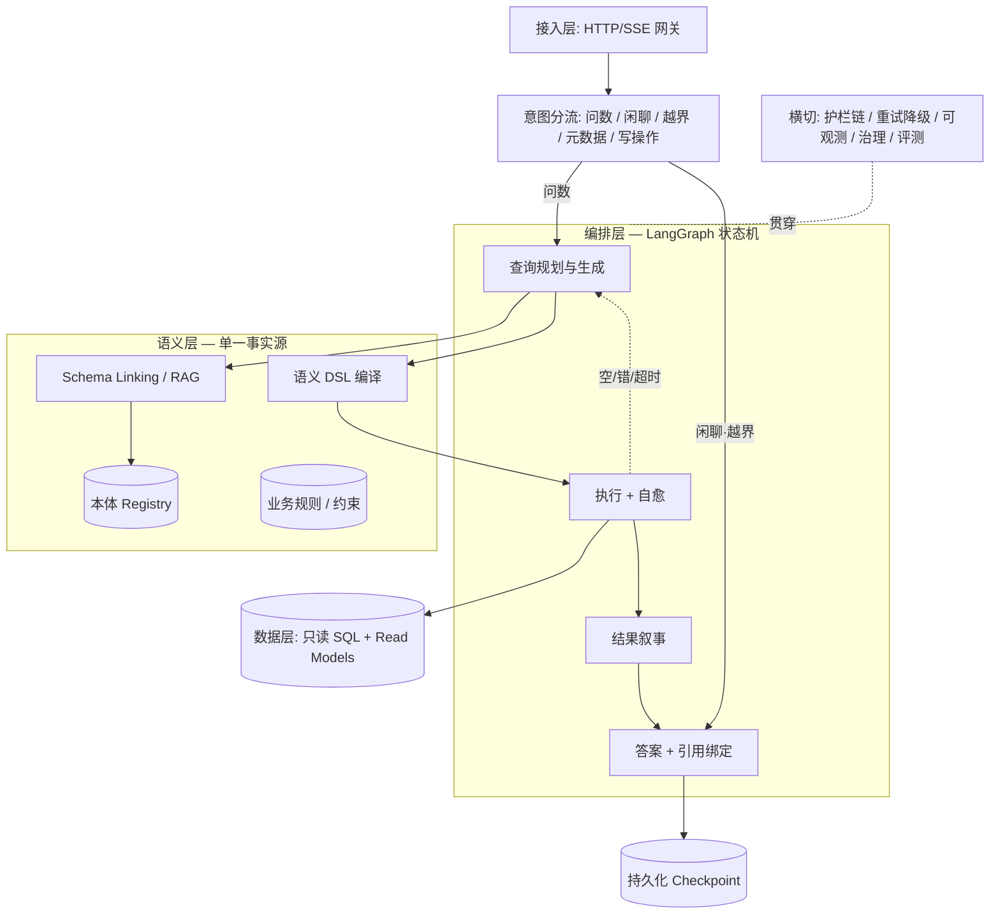
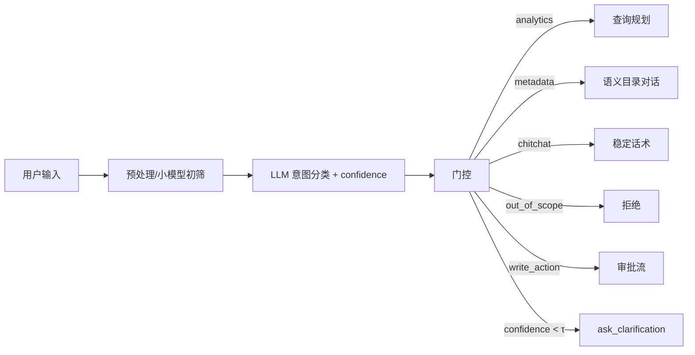
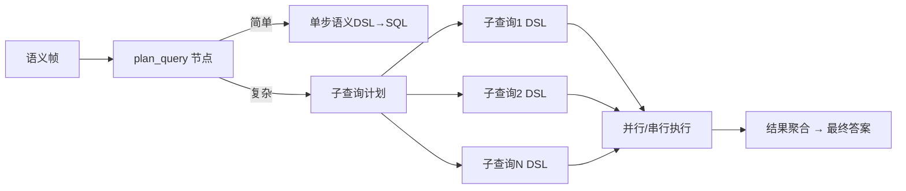
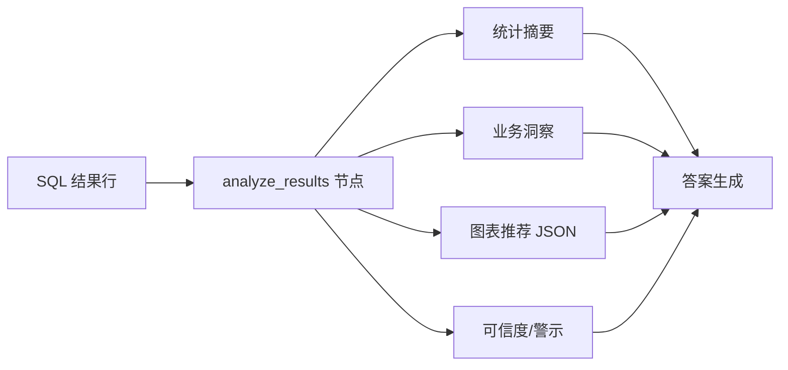
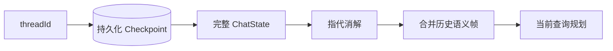
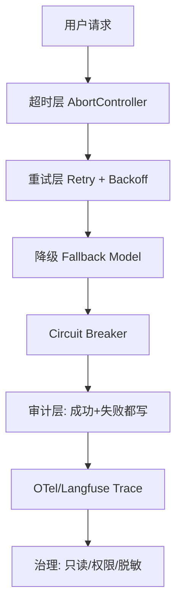
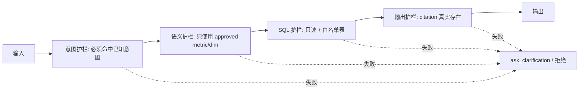

# Data-Agent 智能问数 Agent — 目标架构设计

> **状态**: Draft v1.0  
> **日期**: 2026-07-31  
> **定位**: 架构师级目标架构设计(对标 SOTA),用于团队评审与演进规划  
> **关联**: 《本体智能技术研究报告》《Data-Agent本体智能升级方案》;代码现状审计已同步至 `memory/`

---

## 目录

0. 摘要(TL;DR)
1. 设计目标与评估准则
2. 现状定位(基于代码审计)
3. 目标架构总览
4. 核心设计:智能问数全链路九环
   4.1 意图理解与分流
   4.2 语义层与 Schema 理解
   4.3 查询规划与生成
   4.4 执行与自愈
   4.5 结果分析与叙事
   4.6 答案生成与引用绑定
   4.7 多轮记忆与上下文
   4.8 评测体系
   4.9 韧性 · 可观测 · 治理
5. 关键工程模式(工业级)
6. 分阶段改造路线图(P0/P1/P2)
7. SOTA 对标矩阵
8. 风险与权衡
9. 附录:术语与参考

---

## 0. 摘要(TL;DR)

本设计的目标是:将 Data-Agent 从**"能跑的语义层 Agent"**演进为**"工业级智能问数 Agent"**,使其对中文自然语言问题(含闲聊、越界、元数据探索、复杂分析、多轮追问)都能给出**稳定、可解释、可审计、可治理**的输出。

当前骨架已经走对了关键一步:

- 采用 **LangGraph 状态机 + ReAct 工具循环**,具备显式状态、可恢复、可观测的潜力;
- 建立 **JSON-Schema 本体语义层**,覆盖实体/关系/维度/指标/规则,治理与指纹校验完整;
- 引入了策略门控、空结果自愈诊断、SSE 流式输出等基础能力。

但对照工业级智能问数(如 Snowflake Cortex Analyst、Vanna、阿里 Quick BI 智能小Q、BIRD/Spider 学术 SOTA)仍有 5 个核心缺口:

1. **意图层缺稳定分流**——闲聊、越界、元数据探索、写操作意图未显式建模,仅靠一个过宽正则二值路由;
2. **语义层缺推理深度**——关系/业务规则/LLM 消歧三块是"半装饰",未接入运行时;
3. **输出层缺契约**——`finalize` 无程序化护栏,幻觉引用可过关;
4. **基础设施缺韧性**——LLM 调用无 retry/timeout/降级,失败 run 不留审计;
5. **缺 eval-driven 闭环**——golden 只测路由,不测 SQL 行/答案/引用,无 CI。

**改造主线**:以"**语义层为单一事实源 + 九环全链路 + 确定性护栏链 + eval-driven**"为核心,先补齐韧性(让系统"不掉"),再固化输出契约(让系统"不乱说"),最后建立评测飞轮(让系统"持续变准").

---

## 1. 设计目标与评估准则

### 1.1 目标

为中文汽车测试缺陷数据领域,构建一个:

- **语义准确**: NL 问题可映射到受治理的指标、维度、时间窗;
- **输出稳定**: 闲聊/越界有稳定分支,数据问题有据可查,异常可自愈;
- **可解释**: 每个数据结论带可验证的引用链(工具/版本/行级来源);
- **可治理**: 只读、敏感度、行级权限、审批路径可被策略强制;
- **可演进**: 新指标/维度/业务规则可热插拔,变更可追踪;
- **可评测**: 核心能力(SQL 正确性、引用忠实度、闲聊误路由率)可用 golden set 持续回归。

### 1.2 评估维度

| 维度 | 含义 | 当前自评(项目) | 目标 |
|------|------|----------------|------|
| **正确性** | NL→语义帧→SQL→行的端到端正确 | 未度量(~3/9) | ≥8/9,且有 golden 回归 |
| **稳定性** | 传输/路由/生成/数据异常下的输出稳定 | 2/9 | ≥8/9 |
| **可解释性** | 引用、证据链、查询计划对用户透明 | 6/9(语义层基础好) | ≥8.5/9 |
| **可治理性** | 只读、权限、敏感度、审批策略可强制 | 6/9 | ≥8.5/9 |
| **可观测性** | 失败可复现、延迟可追踪、成本可度量 | 1.5/9 | ≥8/9 |
| **可演进性** | 语义层可扩展、评测驱动迭代 | 3/9 | ≥8/9 |

### 1.3 对标对象

- **Snowflake Cortex Analyst**: 语义层 YAML + Agentic reasoning,强调护栏(只使用定义过的语义对象)、citation、多轮 notebook。
- **Vanna.ai**: RAG over schema/文档/SQL,自纠错的 NL2SQL 开源框架。
- **阿里 Quick BI 智能小Q / 瓴羊智能问数**: 指标平台语义层 + 自然语言图表 + 强治理。
- **Microsoft Copilot in Power BI/Fabric**: 语义模型优先,生成 DAX/SQL。
- **学术 SOTA**: Spider/BIRD benchmark;MAC-SQL(多智能体)、DIN-SQL(分解)、CHESS(schema linking + 自纠错)、DAIL-SQL(few-shot retrieval)。

---

## 2. 现状定位(基于代码审计)

### 2.1 当前架构简述

Data-Agent 当前生产运行时已全面迁移到 **Node.js 主代理 + Python 分析 sidecar**:

- **网关**: `server/index.mjs` HTTP/SSE `:3004`;
- **Agent Runtime**: `server/agentRuntime/langGraphChatRuntime.mjs` 的 **LangGraph StateGraph**,6 节点:`initialize → resolve_context → route_tools → plan_tool_calls ⇄ execute_tool_calls → finalize`;
- **工具编排**: `server/mainAgentToolOrchestrator.mjs` 实现 ReAct 循环,最多 4 步、每步最多 3 工具,带策略门控与空结果自愈;
- **语义层**: `server/ontology/*.mjs` + `backend/analytics/semantic_query.py`,JSON-Schema 本体 + 编译校验 + SQL 生成;
- **LLM 传输**: `server/companyChat.mjs`;
- **评测**: `evals/` 下两套 golden,只覆盖路由和语义帧解析。

### 2.2 成熟度雷达

```text
正确性    ████████░░  ~6/9  (语义层+编译强,但引用/消歧未校验)
稳定性    ██░░░░░░░░  ~2/9  (无 retry/timeout/降级;闲聊易误路由)
可解释性  ██████░░░░  ~6/9  (语义层透明,但答案引用无强制校验)
可治理性  ██████░░░░  ~6/9  (约束/敏感度存在,但规则层未耦合)
可观测性  █░░░░░░░░░  ~1/9  (失败 run 不留痕,无 tracing/span)
可演进性  ███░░░░░░░  ~3/9  (评测只覆盖路由,无答案质量闭环)
```

### 2.3 关键差距(与九环映射)

| 九环 | 当前 | 差距 |
|------|------|------|
| 意图理解 | 单正则 `TOOL_PLANNING_QUERY_RE` | 无闲聊/越界/元数据/写操作显式分支 |
| Schema 理解 | 子串首匹配 | 无 schema linking/RAG、LLM 消歧未接线 |
| 查询生成 | NL→语义DSL→SQL | 关系/规则未接入,不能多跳推理 |
| 执行自愈 | 空结果自动诊断 | 无 SQL 语法/数据/超时错误修复 |
| 结果叙事 | 无 | 数字未自动转化为洞察和图表 |
| 引用绑定 | prompt 嘱托 | 无程序化契约和后置校验 |
| 多轮记忆 | MemorySaver(进程内) | 重启丢失,无指代消解 |
| 评测 | 路由 golden 9 例 + 语义 golden 113 例 | 无答案/SQL 行/引用/闲聊的回归 |
| 韧性 | 裸 fetch | 无 retry/timeout/降级/熔断 |

---

## 3. 目标架构总览

### 3.1 设计原则

1. **语义层是单一事实源**。NL 不直接生成 SQL,而是先解析为受治理的语义查询(指标/维度/时间/过滤),再编译为 SQL。LLM 只能使用已定义的语义对象。
2. **确定性优先,概率性兜底**。意图、路由、护栏、输出契约尽量程序化;LLM 仅用于语义理解、摘要、规划,且必须可被校验。
3. **失败必须可见**。所有失败路径都落审计、可追踪、可回放。
4. **Eval-driven**。新增能力必须先有评测用例;主分支合入前跑 golden + LLM-as-judge 回归。
5. **分层解耦**。接入/编排/语义/数据四层独立演进;横切关注点(韧性/可观测/治理/评测)贯穿各层。

### 3.2 分层架构图



### 3.3 核心数据流

```
用户 NL
  ├─ 闲聊/越界/问候 → 稳定话术 / 越界拒绝(确定性)
  └─ 问数意图
       ├─ 实体链接(Schema Linking): 术语→本体概念(指标/维度/实体)
       ├─ 语义解析: 意图 + 时间窗 + 维度过滤 + 排序/TopN
       ├─ 语义校验: 是否命中 approved metric、是否触发业务规则/约束
       ├─ 查询规划: 单步 or 分解为子查询(趋势+对比+TopN)
       ├─ DSL→SQL 编译
       ├─ SQL 执行 + 自愈(空/错/超时)
       ├─ 结果分析: 统计显著性、异常点、图表推荐
       └─ 答案生成: 自然语言 + 表格/图表 + 引用链
```

## 4. 核心设计:智能问数全链路九环

智能问数不是"把 NL 翻译成 SQL"这一步,而是一个从输入到稳定输出的九环工程。下面逐环说明目标设计、当前现状和改造要点。

### 4.1 意图理解与分流

#### 4.1.1 职责

把用户输入分类到**稳定输出分支**,并为后续节点提供路由决策。至少包括:

| 意图 | 说明 | 输出分支 |
|------|------|----------|
| `analytics` | 数据分析/问数(聚合、趋势、排行、明细) | 进入查询规划 |
| `metadata` | 询问有哪些指标/维度/数据来源/能回答什么 | 直接调 `get_ontology_catalog` / 语义层对话 |
| `chitchat` | 闲聊、问候、寒暄 | 稳定寒暄话术,**不进入工具路径** |
| `out_of_scope` | 政治、医疗、写代码、与汽车测试无关 | 确定性拒绝 + 引导回业务 |
| `write_action` | 更新/删除/写入 Octane 等 | 进入 action 审批流,先 dry-run + 人类确认 |
| `clarification` | 输入本身模糊,需要反问 | 调用 `ask_clarification` 返回一个问题 |

#### 4.1.2 SOTA 做法

- **置信度门控的显式分类器**:先用轻量模型/规则做预分类,不确定的再丢给 LLM;输出概率 `P(intent)` 和 `entropy`,低于阈值直接走 `clarification`。
- **分支隔离**:chitchat/out_of_scope 与 analytics 必须物理隔离(不同 LangGraph 分支),绝不能因为正则不命中就 fallback 到 raw LLM 数据回答。
- **动态示例 few-shot**:针对相似词("测试怎么样" vs "测试覆盖率多少")在 prompt 里给示例,减少误路由。

#### 4.1.3 当前现状

当前路由由 `mainAgentToolPlanning.mjs:43` 的 `TOOL_PLANNING_QUERY_RE` 单正则决定,匹配到就进工具循环,否则进 `finalize`。问题:

- 无 chitchat/out_of_scope 显式分支,问候语被裸 LLM 回答,质量不可控;
- 正则过宽(命中 `测试/风险/多少/count/summary/怎么看`),闲聊会误触发数据分析;
- `selectMainAgentToolset` 虽计算 `confidence`,但 `shouldPlanTools` 未使用,confidence 再高也是关键字说了算。

#### 4.1.4 目标设计

将 LangGraph 的 `route_tools` 节点升级为**多分支意图分类器**:



关键设计点:

- `confidence` 阈值 `τ` 可调(建议 `τ ≥ 0.85` 走确定分支,`< 0.6` 直接反问,中间区间 LLM 自纠);
- chitchat 分支的回答文本由**配置化模板**提供(非 LLM 实时生成),保证每次"你好"都回答一致;
- 每个分支有明确的事件类型写入 audit(`intent.classified`)。

#### 4.1.5 改造点

- 在 `server/agentRuntime/langGraphChatRuntime.mjs` 扩展 `routeTools` 为多分支条件边;
- 用 `mainAgentIntentRouter.mjs`(当前是纯 re-export 桩)实现分类器,引入置信度、模板集、few-shot 示例;
- 保留当前 `selectMainAgentToolset` 作为 analytics 分支内的工具子选择,不把它当成分类器用。

---

### 4.2 语义层与 Schema 理解

#### 4.2.1 职责

把用户自然语言中的**业务术语**准确链接到**本体中的语义对象**(指标、维度、实体、时间窗),即 **Schema Linking**。它是 NL2SQL 正确性的第一决定因素(Spider/BIRD 上 schema linking 错误占全部错误的 50%+)。

#### 4.2.2 SOTA 做法

- **两阶段召回+消歧**:
  1. **候选召回**:BM25/向量混合检索 over ontology 术语、别名、示例问题、历史 SQL;
  2. **消歧排序**:用轻量模型或 LLM 对多候选打分,输出最可能的指标/维度 + 理由。
- **LLM-in-the-loop 消歧**:对歧义(如"缺陷率"可能指 `defect.count/defect_density/defect.resolve_rate`)不 guess,而是返回候选让用户点选,或自动选 approved 默认值并声明。
- **业务规则/约束接入**:在语义查询编译前,检查是否触发规则(如"比较不同 Q-Gate 阶段时必须指明阶段")。

#### 4.2.3 当前现状

- 词汇匹配是**子串首匹配**(`registry.matchTerms`),无打分、无模糊、无 embedding;
- `semanticCandidate.mjs` 已搭好 LLM 候选消歧模块,但**未接线**(`aiAnalyticsContext.mjs:252` 调用 resolver 时没传 candidate);
- `business_rules.json` 运行时**零读取**,最有价值的领域知识未参与语义校验;
- `relationships.json` 被当成 1-hop JOIN 规格,未用于多跳/上下文推理。

#### 4.2.4 目标设计

```
用户问题
  ├─ 候选召回(BM25 + 向量) → 指标/维度/实体候选集合
  ├─ 消歧排序(LLM/规则) → 唯一语义帧
  ├─ 规则校验 → 触发澄清 or 修正语义帧
  └─ 输出: { intent, metricIds, dimensionIds, filters, timeWindow, derivedMetrics, ambiguityResolved }
```

关键设计点:

- **语义层 RAG 索引**:把 `ontology/v1/*.json` 编译为可检索的语义单元(每个 metric/dimension/entity/vocab 一条文档),存入向量库或倒排索引;
- **候选置信度**:每个匹配项带 `score` 和 `matchType`(exact/alias/fuzzy/example),供后续门控决策;
- **规则引擎**:把 `business_rules.json`/`constraints.json` 解析为可执行校验函数,在 `queryPlanner` 中调用;
- **关系推理**:当问题涉及 lineage/traceability(如"某 feature 下有哪些 defect"),允许基于 `relationships.json` 做多跳路径展开,而不是硬编码 Python 图。

#### 4.2.5 改造点

- 在 `server/ontology/` 下新增 `semanticRetrieval.mjs`: 负责 ontology RAG 召回与候选生成;
- 把 `semanticCandidate.mjs` 接入 `aiAnalyticsContext.mjs:252` 的 resolver 调用,传入 candidate 辅助消歧;
- 在 `queryPlanner.mjs` 增加规则校验入口,读取 `business_rules.json` 和 `constraints.json`;
- 让 `backend/analytics/ontology_context.py:164-170` 从 `relationships.json` 动态加载,消除双目录。

---

### 4.3 查询规划与生成

#### 4.3.1 职责

将语义帧转化为**可执行计划**。复杂问题(对比趋势 + TopN + 明细)不宜单步 SQL,而应**分解为子查询**再汇总。

#### 4.3.2 SOTA 做法

- **单步 SQL**:简单聚合/过滤问题,直接语义 DSL → SQL。
- **分解式规划(DIN-SQL / CHESS)**:复杂问题拆成"查趋势 → 查同比 → 查 TopN 模块 → 查明细"多个子查询,每个子查询独立生成 SQL、执行、验证,最后由 LLM 汇总。
- **Plan-then-Execute**:先输出完整计划(伪代码/子查询列表),用户确认或自动执行;降低幻觉 SQL。
- **Few-shot Retrieval**:根据语义相似度从历史问题-SQL 库中检索 top-k 示例,提升生成稳定性。

#### 4.3.3 当前现状

当前 `mainAgentToolTurn` 已经是 ReAct 循环,具备多步能力,但规划是隐式的(模型自己决定 next tool),没有显式的"计划节点"。`queryCompiler.mjs` 能把语义帧编译为 SQL,但复杂问题的分解靠模型临场发挥,缺乏结构化约束。

#### 4.3.4 目标设计

在 LangGraph 中显式增加 `plan_query` 节点:



- **计划 Schema**:输出 JSON `{ planType: 'single' | 'decomposed', steps: [...], reasoning }`,强制模型显式规划;
- **子查询 DSL 校验**:每个子查询必须先过 `queryCompiler` 和 `PolicyGate`,才能生成 SQL;
- **SQL 白名单**:生成的 SQL 只能读指定 read model,禁止原生 DDL/DML/子查询注入;
- **Few-shot 检索**:从 `evals/historical-queries/` 或生产日志中检索相似历史查询作为示例。

#### 4.3.5 改造点

- 在 `langGraphChatRuntime.mjs` 的 `route_tools` 后新增 `plan_query` 节点,替代或前置现有 `plan_tool_calls`;
- 扩展 `server/ontology/queryPlanner.mjs` 支持 `planType: decomposed` 和多子查询输出;
- 在 `server/ontology/` 新增 `queryExampleStore.mjs`,维护历史问题→语义帧→SQL 的示例库;
- 所有 SQL 生成后经过 `PolicyGate.validateToolCallAllowed` 和语法白名单双重检查。

---

### 4.4 执行与自愈

#### 4.4.1 职责

把 SQL 或语义查询交给数据层执行,并对**空结果、SQL 错误、数据错误、超时**进行自愈处理,而不是直接告诉用户"查不到"。

#### 4.4.2 SOTA 做法

- **SQL 执行沙箱**:只读账号、查询超时、行数/成本限制、禁止写操作;
- **错误分类 + Self-correction**:把 DB 报错解析为语法/字段/类型/权限/超时等类别,LLM 据此修正 SQL 或重生成语义帧;
- **空结果诊断**:不仅诊断空结果,还要区分"过滤过严""时间窗无数据""字段拼写错误"等;
- **执行验证**:对生成结果做合理性校验(如聚合行数、数值范围、环比是否异常),异常则重新查询或提示用户。

#### 4.4.3 当前现状

- 已有 `diagnose_analytics_empty` 工具,当 `query_analytics` 返回空时自动触发(`mainAgentToolOrchestrator.mjs:179-198`),这是很好的基础;
- 但缺少 SQL 语法/数据/超时错误的分类与自愈;LLM 调用层无 retry/timeout;
- `backend/analytics/api.py` 27 条路由目前没有统一超时/配额保护。

#### 4.4.4 目标设计

```
执行器
  ├─ 正常返回 → 结果分析
  ├─ 空结果  → diagnose_analytics_empty → 尝试放宽过滤 or ask_clarification
  ├─ SQL 错误 → parse error category → 自动修复(1次) or 返回友好错误
  ├─ 超时    → 降级为采样/近似/分页 or 提示用户缩小范围
  └─ 数据异常(值域/环比) → 标记可信度 + 建议复核
```

关键设计点:

- **统一执行客户端**:封装 `backend/analytics/api.py` 调用,内置 timeout、retry、quota、只读校验;
- **错误码体系**:为执行结果定义标准错误码(`EMPTY_RESULT`、`FILTER_TOO_STRICT`、`SQL_SYNTAX`、`TIMEOUT`、`DATA_ANOMALY`、`NO_PERMISSION`),而不是把异常栈抛给用户;
- **自愈预算**:每轮对话最多 2 次自动修复,超过则转人工澄清,避免无限循环;
- **空结果透明**:自愈后仍空,则明确告诉用户"在 X 时间窗/过滤条件下无数据",而不是模糊说"没有"。

#### 4.4.5 改造点

- 改造 `server/companyChat.mjs` 和主工具 HTTP 调用,增加 `AbortController` timeout、指数退避 retry、模型降级 fallback;
- 在 `server/mainAgentTools.mjs` 的 analytics 调用处消费 `retryable` 标志,并实现错误码映射;
- 扩展 `diagnose_analytics_empty` 为更通用的 `execution_healer`,处理空/SQL 错/超时三类;
- 在 `backend/analytics/api.py` 增加请求级 timeout 和 query cost limit。

### 4.5 结果分析与叙事

#### 4.5.1 职责

把原始 SQL 行(aggregate rows / records)转化为**业务洞察**:趋势解读、异常点标注、同比环比含义、图表推荐。智能问数的最终价值不是返回表格,而是返回"结论"。

#### 4.5.2 SOTA 做法

- **NL2Insight**: 对返回数据做自动分析(极值、突变、分布、相关性),用 LLM 生成一段"数据叙事";
- **自动图表选择**:根据数据形状(1D/2D/时间序列/排行)推荐 chart type(bar/line/pie/table);
- **置信度标注**:对样本量小、空值多、环比异常的数据标注"需谨慎解读"。

#### 4.5.3 当前现状

当前 `finalize` 节点把工具返回的 `contextText` 直接拼给 LLM,由 LLM 自行总结。没有显式的"结果分析"节点,也没有图表推荐能力。

#### 4.5.4 目标设计

在 `execute_tool_calls` 之后、`finalize` 之前新增 `analyze_results` 节点:



关键设计点:

- **输出结构**:统一为 `{ summary, insights[], chartRecommendation, warnings[], rowCount, sampleRows }`;
- **图表推荐**:优先由规则推荐,LLM 仅做二次确认,避免"给时间序列推荐饼图"这类错误;
- **警示规则**:如环比样本量 < 30、时间窗跨假期、字段脱敏导致无法精确比较等,必须显式提示。

#### 4.5.5 改造点

- 在 `langGraphChatRuntime.mjs` 增加 `analyze_results` 节点;
- 在 `server/` 新增 `resultAnalysis.mjs`,实现统计摘要 + 图表推荐 + 警示规则;
- 定义图表 schema,使前端可直接渲染。

---

### 4.6 答案生成与引用绑定

#### 4.6.1 职责

生成最终自然语言答案,并确保答案中的**每个数据结论都能追溯到具体工具输出和语义对象版本**。

#### 4.6.2 SOTA 做法

- **结构化输出**:答案按 JSON schema 输出,包含 `answer_text`、`citations[]`、`confidence`、`disclaimers[]`;
- **Citation 强制绑定**:每个 citation 必须指向 `toolCallId` + `ontologyVersion` + `schemaFingerprint` + `rowSignature`;
- **后置校验(Post-hoc Faithfulness Check)**:用规则或 LLM 检查答案中的数字是否出现在工具结果中,引用 ID 是否真实存在;
- **拒绝胡说**:如果 LLM 生成了工具结果中没有的信息,通过校验拦截并替换为"该信息无法从当前数据确认"。

#### 4.6.3 当前现状

`finalize` 节点(`langGraphChatRuntime.mjs:478-520`)只做消息拼接和流式回传;citation 依赖 system prompt(`companyChat.mjs:9-23`)的文字嘱托,**无程序化校验**。幻觉引用可以过关。

#### 4.6.4 目标设计

```
finalize
  ├─ 接收: 工具结果 + 语义帧 + 结果分析 + 证据链(evidence)
  ├─ 生成: answer JSON(含 citations)
  ├─ 校验: 每个 citation 存在且数字匹配
  ├─ 失败: 退回 LLM 重生成(最多 2 次)或返回兜底话术
  └─ 输出: SSE 流式文本 + 结构化 citation 事件
```

关键设计点:

- **输出 JSON schema**:
  ```json
  {
    "answer_text": "string",
    "citations": [
      { "toolCallId": "...", "ontologyVersion": "...", "schemaFingerprint": "...", "claim": "...", "sourceRows": 12 }
    ],
    "confidence": "high|medium|low",
    "disclaimers": ["样本量较小"],
    "followUpQuestions": ["要看最近 7 天吗?"]
  }
  ```
- **引用校验器**:独立函数,不依赖 LLM,直接检查 citation 中 `claim` 的数字是否在对应工具结果中出现;
- **兜底策略**:校验失败 2 次后,返回"根据现有数据,无法确认该结论,请缩小范围或联系数据owner"。

#### 4.6.5 改造点

- 重构 `finalize` 节点,引入输出 schema 和 citation 校验;
- 改造 `mainAgentEvidence.mjs`,让 `evidence` 携带 `ontologyVersion`、`schemaFingerprint`、`sourceRevision`;
- 在 `server/` 新增 `answerValidator.mjs`,实现程序化 citation 校验。

---

### 4.7 多轮记忆与上下文

#### 4.7.1 职责

维护跨轮对话的状态,包括历史语义帧、历史工具结果、用户确认的歧义选择、上下文中的指代消解。

#### 4.7.2 SOTA 做法

- **持久化 Checkpoint**:使用 `SqliteSaver`/`PostgresSaver`/`RedisSaver`,保证服务重启后可恢复对话;
- **上下文压缩**:当对话过长时,对历史工具结果做摘要,保留关键事实,丢弃冗余行;
- **指代消解**:把"那上个月呢?"解析为"用当前语义帧,把时间窗改为上月";
- **可审计线程**:每个 thread 的完整状态可导出回放。

#### 4.7.3 当前现状

- 使用 `MemorySaver`(`langGraphChatRuntime.mjs:279`),进程内存储,**服务重启丢失**;
- `runtimeAuditStore.mjs` 写入 `threads/{threadId}.json`,但只存摘要(`queryText`、`metrics`、`runtimeEvents`),无法完整恢复状态;
- 没有显式指代消解模块,follow-up 问题依赖 LLM 对上下文的理解。

#### 4.7.4 目标设计



关键设计点:

- **LangGraph checkpointer 升级**:迁移到 `SqliteSaver` 或 `PostgresSaver`;
- **语义帧历史**:保留最近 N 个语义帧,支持"按上一个问题的维度,换时间窗/指标";
- **指代规则库**:针对常见中文 follow-up("那呢?""再细一点""上个月呢?")做规则映射,不确定时调用 `ask_clarification`;
- **上下文预算管理**:限制 tokens/rows,超出时对历史结果做 LLM 摘要。

#### 4.7.5 改造点

- 在 `langGraphChatRuntime.mjs` 替换 `MemorySaver` 为 `SqliteSaver`/`PostgresSaver`;
- 在 `server/` 新增 `contextManager.mjs`,负责指代消解、语义帧合并、预算压缩;
- 扩展 `ChatState` 注解,显式保存 `lastResolvedSemanticFrame` 和 `resolvedAmbiguities`。

---

### 4.8 评测体系

#### 4.8.1 职责

量化 Agent 在**语义理解、SQL 正确性、答案忠实度、闲聊不误路由、系统韧性**上的表现,并作为合入门禁。

#### 4.8.2 SOTA 做法

- **SQL 正确性**:执行生成 SQL,与 golden SQL 对比结果集(Execution-based Match);
- **语义帧正确性**:metric/dimension/filter/time 是否匹配;
- **Faithfulness/Relevancy**:用 LLM-as-judge(Ragas/DeepEval)判断答案是否基于工具结果、是否回答了用户问题;
- **路由准确率**:chitchat/越界/问数分类准确率、误路由率;
- **CI 回归**:每次 PR 跑 golden set,失败即 block merge。

#### 4.8.3 当前现状

- `evals/main-agent/target/agent-golden.jsonl` 9 例,只测路由意图 + 工具名集合;
- `evals/main-agent/target/semantic-golden.jsonl` 113 例,只测语义帧解析;
- **不测** SQL 返回行、答案文本、引用忠实度、闲聊行为;
- 无 `.github/workflows`,没有 CI。

#### 4.8.4 目标设计

建立四层评测:

| 层级 | 评测对象 | 方法 | 数量目标 |
|------|----------|------|----------|
| L1 路由 | intent classification / tool selection | 确定性 golden | ≥100 例 |
| L2 语义 | 语义帧(metric/dim/filter/time) | 确定性 golden + 模糊匹配 | ≥200 例 |
| L3 SQL | SQL 执行结果集 | Execution Match vs golden | ≥100 例 |
| L4 答案 | 答案忠实度、相关性、引用 | LLM-as-judge(Ragas/DeepEval) | ≥50 例 |
| L5 韧性 | timeout/retry/误路由/失败审计 | 模拟故障注入 | ≥20 例 |

关键设计点:

- **Execution-based SQL eval**:不比较 SQL 字符串,比较执行结果,更贴近业务正确;
- **LLM-as-judge prompt 版本化**:judge prompt 变更必须同步跑全量 L4,避免 judge 漂移;
- **CI 门禁**:`.github/workflows/eval.yml` 跑 L1-L5,失败禁止合入;
- **生产 feedback 闭环**:生产上的 thumbs-up/down 定期抽样进入 L4 golden。

#### 4.8.5 改造点

- 扩展 `evals/` 为 `evals/{routing,semantic,sql,answer,resilience}/`;
- 引入 `Ragas` 或 `DeepEval` 做 L4 LLM-as-judge;
- 新增 `scripts/runEvals.mjs`,统一跑 L1-L5 并输出报告;
- 创建 `.github/workflows/eval.yml`。

---

### 4.9 韧性 · 可观测 · 治理

#### 4.9.1 职责

作为横切关注点,保证系统在各种异常下不崩、可知、可控。

#### 4.9.2 SOTA 做法

- **韧性**:timeout、指数退避重试、模型降级 fallback、circuit breaker、bulkhead(并发隔离)、幂等请求;
- **可观测**:OpenTelemetry / Langfuse / Arize Phoenix,trace 贯穿 LLM/tool/SQL,log 结构化,失败可回放;
- **治理**:只读语义层、行级权限、敏感度脱敏、写操作审批链、审计不可抵赖。

#### 4.9.3 当前现状

- **韧性**:裸 `fetch`,无 timeout/retry/fallback;`retryable` 标志零消费方;
- **可观测**:`runtimeAuditStore.mjs` 写文件 JSONL,但**失败 run 不留痕**(`persistRuntimeState` 只在成功后调用);无 tracing span;无 token/成本追踪;
- **治理**:语义层只读(架构上)和敏感度脱敏已落地,但业务规则未接入,行级权限依赖 read model,未显式建模。

#### 4.9.4 目标设计



关键设计点:

- **LLM 调用统一封装**:所有 LLM 调用走 `companyChat.mjs`,统一配置 timeout、retry、fallback model、token budget;
- **Audit-on-failure**:把 `persistRuntimeState` 放进 `finally`,失败的 run 必须留下 events + stack + request/response snapshot;
- **Tracing**:每个 tool call、每个 SQL 执行、每个 LLM 调用都生成 span,关联 threadId/runId/toolCallId;
- **治理策略即代码**:把只读、敏感度、审批规则写成可执行策略,在 `PolicyGate` 中统一校验。

#### 4.9.5 改造点

- 重写 `server/companyChat.mjs`,引入 `fetchWithResilience`: AbortController timeout、指数退避、模型 fallback;
- 改造 `server/index.mjs`,增加请求体大小限制、全局超时、限速;
- 在 `langGraphChatRuntime.mjs` 用 `finally` 包围 `graph.invoke`,确保失败也写 audit;
- 集成 OpenTelemetry 或 Langfuse,生成 trace;
- 迁移 checkpointer 到持久化存储。

## 5. 关键工程模式(工业级)

以下模式不是可选优化,而是智能问数 Agent 进入生产环境所必需的工程基线。

### 5.1 确定性护栏链(Deterministic Guardrail Chain)

不要把所有安全都交给 LLM。核心路径上必须有**可程序化验证**的护栏:



- **失败即澄清**:任何护栏失败不抛异常给用户,而是进入 `ask_clarification` 或稳定拒绝话术;
- **拒绝含糊**:拒绝时必须说明"我不能做什么"和"你可以怎么做",而不是简单的"我不懂"。

### 5.2 输出契约(Output Contract)

把 `finalize` 从"拼消息给 LLM"变成"生成并校验结构化输出"。

- 每个答案必须携带 `{ answer_text, citations[], confidence, disclaimers[] }`;
- citation 必须可追溯到 `toolCallId` 和 `ontologyVersion`;
- 校验失败启动**有限重试**(≤2 次),仍失败则返回兜底话术。

### 5.3 传输韧性(LLM Resilience)

所有 LLM/分析服务调用统一封装:

- **Timeout**: `AbortController` + 可配置超时(建议 30s 主模型,10s 轻量模型);
- **Retry**: 指数退避 + jitter,仅对 429/5xx/timeout 重试;
- **Fallback**: 主模型失败降级到次模型,仍失败返回确定性兜底;
- **Circuit Breaker**: 连续失败 N 次后短暂熔断,避免拖垮上游;
- **Idempotency**: 重试请求带 `idempotency-key`,避免重复写/重复 action。

### 5.4 可观测性(Observability)

- **Trace 贯穿**: 一个 thread 从 HTTP 请求到最终答案是一个 trace;每个 LLM/tool/SQL 调用是一个 span;
- **失败必留痕**: `graph.invoke` 必须包在 `try/finally` 里,失败时写 `run-failures.jsonl`,包含 stack、messages、toolCalls;
- **Token/成本追踪**: 每个 LLM span 记录 input/output tokens、model、latency、cost;
- **语义事件日志**: 记录 `intent.classified`、`semantic_frame.resolved`、`sql.executed`、`citation.validated` 等业务事件,便于事后复盘"这个答案为什么是这样"。

### 5.5 Eval-driven Development

新增能力前,先写评测用例:

- 语义层变更 → 必须跑 `semantic-golden`;
- 新指标上线 → 必须跑 `sql-golden`;
- 答案生成调整 → 必须跑 `answer-golden`(LLM-as-judge);
- 路由逻辑改动 → 必须跑 `routing-golden` + 韧性测试;
- CI 失败禁止合入。

### 5.6 编排范式与 Human-in-the-loop

当前 LangGraph 6 节点合理,建议演进到 **Supervisor + Worker** 模式:

- **Supervisor 节点**:只做路由、校验、决策;
- **Worker 节点**:每个子任务一个 worker(语义解析、SQL 执行、结果分析、答案生成);
- **Human-in-the-loop**:写操作、跨阈值聚合、歧义消解,在关键节点中断等待人类确认;
- **可恢复性**:任何 worker 失败可从 checkpoint 恢复,而不是从头执行。

---

## 6. 分阶段改造路线图(P0/P1/P2)

### 6.1 改造主线

> **先让系统不掉 → 再让系统不乱说 → 最后让系统持续变准。**

### 6.2 阶段表

| 阶段 | 主题 | 关键改动 | 验收标准 | 依赖 | 工作量(人天) |
|------|------|----------|----------|------|--------------|
| **P0** | 稳定运行 | 1. `companyChat.mjs` 加 timeout/retry/fallback/熔断; 2. `index.mjs` 加 body limit / 全局超时; 3. `graph.invoke` 包 `finally`,失败必写 audit; 4. 多分支意图分类器(chitchat/out_of_scope/analytics)+ 置信度门控; 5. chitchat 模板化回答。 | 单点 LLM 5xx/timeout 自动恢复;闲聊误路由率 < 5%;失败 run 100% 留痕。 | 无 | 8-12 |
| **P0.5** | 持久化记忆 | `MemorySaver` → `SqliteSaver`;checkpoint 含完整 ChatState;thread 可恢复。 | 服务重启后对话可继续;checkpoint 不丢。 | P0 | 3-5 |
| **P1** | 输出可解释 | 1. `finalize` 输出 JSON schema + citation 校验; 2. `answerValidator.mjs` 后置校验; 3. `evidence` 携带 ontologyVersion/schemaFingerprint; 4. 失败兜底话术。 | 答案 citation 100% 可追溯到工具结果;幻觉引用被拦截;用户可见引用链。 | P0 | 6-10 |
| **P1.5** | Schema Linking 升级 | 1. ontology RAG 索引(BM25+向量); 2. `semanticCandidate.mjs` 接线到 resolver; 3. 歧义自动澄清; 4. 规则/约束接入 planner。 | schema linking 准确率 ≥ 90%(测试集);业务规则被实际执行。 | P1 | 8-12 |
| **P2** | 评测飞轮 | 1. `evals/` 扩展为 L1-L5; 2. 引入 Ragas/DeepEval; 3. `scripts/runEvals.mjs`; 4. `.github/workflows/eval.yml`; 5. 生产 feedback 入库。 | 每次 PR 自动跑 eval;新增功能无 eval 不过审。 | P1.5 | 6-10 |
| **P2.5** | 结果叙事 + 图表 | 1. `analyze_results` 节点; 2. 统计摘要 + 洞察 + 图表推荐; 3. 前端渲染 chart。 | 聚合问题自动返回 insight 和推荐图表。 | P1 | 5-8 |
| **P3** | 关系推理 + 复杂规划 | 1. `relationships.json` 多跳路径展开; 2. `plan_query` 显式分解节点; 3. Python traceability 图读 ontology 而非硬编码。 | lineage/traceability 类问题可通过关系推理回答;复杂问题自动分解。 | P2 | 10-15 |

### 6.3 建议落地顺序

```
P0(不掉) → P0.5(记忆) → P1(不乱说) → P1.5(语义准) → P2(能度量) → P2.5(有洞察) → P3(能推理)
```

- **P0 必须最先做**:没有韧性,后面的优雅设计都是空中楼阁;
- **P1 紧接 P0**:输出可解释是"智能问数"区别于"玩具 demo"的分界线;
- **P2 必须在 P1.5 之后**:评测需要稳定语义层和输出契约作为基准,否则 golden 会剧烈抖动。

---

## 7. SOTA 对标矩阵

| 能力维度 | Data-Agent 当前 | Data-Agent 目标 | Snowflake Cortex Analyst | Vanna | 阿里 Quick BI 智能小Q | CHESS / DIN-SQL |
|----------|-----------------|-----------------|--------------------------|-------|------------------------|-----------------|
| **意图分流** | 单正则二值路由,无闲聊分支 | 多分支分类器 + confidence 门控 + 模板化 chitchat | 显式任务分类,语义层护栏 | 无闲聊,纯 NL2SQL | 闲聊/问数/图表多意图 | 按 SQL 任务类型分类 |
| **Schema Linking** | 子串首匹配 | RAG + 候选消歧 + LLM 辅助 | YAML 语义文件强 schema | RAG over DDL/Docs/SQL | 指标平台强语义层 | Schema linking + entity resolution |
| **查询分解** | 隐式 ReAct | 显式 plan_query,单步/分解可切换 | 复杂问题自动分解 | 多为单步 | 多轮多步 | CHESS 模块化分解;DIN-SQL 分步 |
| **Self-correction** | 空结果诊断 | 空/SQL错/超时三类自愈 | 受控语义对象内自纠 | SQL 执行失败自纠 | 有异常提示 | CHESS 执行反馈自纠 |
| **Citation / 可解释** | Prompt 嘱托 | 结构化 citation + 后置校验 | 强 citation 与 notebook | 弱 | 指标血缘 + 图表来源 | SQL 作为解释 |
| **多轮记忆** | MemorySaver(进程内) | SqliteSaver + 指代消解 | 持久化 notebook | 会话级 | 持久化 + 上下文 | 通常单轮 |
| **结果叙事/图表** | 无 | analyze_results + 图表推荐 | 自动洞察 | 需自行构建 | 自动图表 + 洞察 | 无 |
| **Eval 体系** | 路由+语义帧 golden | L1-L5 + CI | 内部评估 + 用户反馈 | 训练准确率 | 业务指标 + A/B | Execution Match |
| **韧性** | 裸 fetch | timeout/retry/fallback/熔断 | Snowflake 基础设施 | 依赖部署方 | 企业级网关 | 非重点 |
| **治理/安全** | 敏感度脱敏 + 只读架构 | 策略即代码 + 行级权限 + 审批链 | 强治理,只读语义对象 | 依赖权限 | 强数据权限 | 非重点 |

### 7.1 关键借鉴

- **从 Cortex Analyst 学**:语义层即护栏,LLM 只能使用已定义语义对象;
- **从 Vanna 学**:RAG over 历史问题-SQL 对 schema linking 和 few-shot 生成非常有价值;
- **从 Quick BI 学**:结果叙事和自动图表是用户感知的"智能"关键;
- **从 CHESS/DIN-SQL 学**:复杂问题必须显式分解,且每一步都可以被验证。

---

## 8. 风险与权衡

### 8.1 工程权衡

| 决策 | 取舍 | 建议 |
|------|------|------|
| **确定性护栏 vs 灵活性** | 护栏越多越安全,但也越容易拒绝合理问题 | 核心路径强护栏,边缘场景允许 LLM 兜底 + 澄清 |
| **LLM 主导 vs 规则主导** | LLM 灵活但不可控;规则稳定但覆盖窄 | 意图/校验/治理用规则;语义理解/叙事用 LLM |
| **单步 SQL vs 分解规划** | 分解更准但更慢更贵 | 简单问题单步,复杂问题按阈值触发分解 |
| **持久化 checkpoint 成本** | SqliteSaver 增加 IO | 生产必须,可用 Redis 缓存热线程 |
| **LLM-as-judge 成本** | 评测本身消耗 token | L4 抽样跑 + 变更触发全量,日常不跑全量 |

### 8.2 主要风险

1. **过度工程**:九环全做完周期长,可能 P0 还没上线就追求 P3。**缓解**:严格按 P0→P3 顺序,每阶段都可独立交付价值。
2. **语义层维护负担**:RAG 索引、规则引擎、关系推理都依赖本体质量。**缓解**:先固化本体治理流程(fingerprint/CI),再叠加推理能力。
3. **LLM-as-judge 漂移**:judge 模型升级会导致历史分数不可比。**缓解**:judge prompt 版本化,变更时跑全量并记录基线。
4. **韧性增加复杂度**:retry/fallback 可能掩盖真实故障。**缓解**:熔断 + 告警,重试次数和降级事件必须可观测。
5. **v2 worktree 重复建设**:仓库已有 `testing-quality-ontology-v2` worktree 在做 runtime 增强。**缓解**:动手前先对齐 v2 已覆盖范围,避免重复。

---

## 9. 附录:术语与参考

### 9.1 术语

- **NL2SQL / Text-to-SQL**:自然语言到 SQL 的转换,智能问数的核心技术。
- **Schema Linking**:把问题中的实体/属性映射到数据库 schema(表/列/语义对象)。
- **Semantic Layer(语义层)**:在原始数据库之上定义受治理的指标/维度/时间模型的层,代表产品:dbt Semantic Layer、Cube、Palantir Ontology、Snowflake Cortex Analyst。
- **Execution-based Match**:不比较 SQL 文本,而是比较执行结果集,判断 SQL 正确性。
- **Faithfulness**:答案是否完全基于检索/工具结果,无幻觉。
- **LLM-as-judge**:用 LLM 对生成答案做自动评分(忠实度、相关性等)。
- **Checkpoint / Saver**:LangGraph 中持久化图状态的机制,支持中断恢复。
- **Guardrails(护栏)**:对 LLM 输入/输出做程序化约束的机制。

### 9.2 参考(对标对象与范式)

- Snowflake Cortex Analyst — 语义层 + Agentic reasoning + citation
- Vanna.ai — RAG-based NL2SQL 开源框架
- 阿里 Quick BI 智能小Q / 瓴羊智能问数 — 指标平台 + 自然语言图表
- Microsoft Copilot in Power BI / Fabric — 语义模型优先
- Spider(Yale, 2018) / BIRD(2023)— NL2SQL 学术 benchmark
- MAC-SQL、DIN-SQL、CHESS、DAIL-SQL — NL2SQL 学术 SOTA 方法
- LangGraph(LangChain)— 状态机式 agent 编排
- Ragas / DeepEval / promptfoo — RAG/LLM 评测框架
- OpenTelemetry GenAI / Langfuse / Arize Phoenix — LLM 可观测性
- NeMo Guardrails / Guardrails AI — LLM 护栏

### 9.3 本文档涉及的项目文件索引

- 网关: `server/index.mjs`
- Agent Runtime: `server/agentRuntime/langGraphChatRuntime.mjs`、`runtimeAuditStore.mjs`
- 工具编排: `server/mainAgentToolOrchestrator.mjs`、`mainAgentToolPlanning.mjs`、`mainAgentToolRegistry.mjs`、`mainAgentTools.mjs`、`mainAgentEvidence.mjs`
- 意图/策略(当前为 re-export 桩): `mainAgentIntentRouter.mjs`、`mainAgentPolicyGate.mjs`、`mainAgentToolLoop.mjs`
- 语义层: `server/ontology/registry.mjs`、`resolver.mjs`、`queryCompiler.mjs`、`queryPlanner.mjs`、`semanticCandidate.mjs`、`validator.mjs`
- LLM 传输: `server/companyChat.mjs`、`chatModelConfig.mjs`
- Python 分析: `backend/analytics/api.py`、`semantic_query.py`、`ontology_context.py`、`traceability_models.py`
- 本体源: `ontology/v1/*.json`
- 评测: `evals/main-agent/target/*.jsonl`

---

> **下一步建议**:先确认 `testing-quality-ontology-v2` worktree 已覆盖 P0 中哪些项,然后从 P0 第 1 条(LLM 传输韧性)开始动手——这是投入产出比最高、风险最低的改进。
